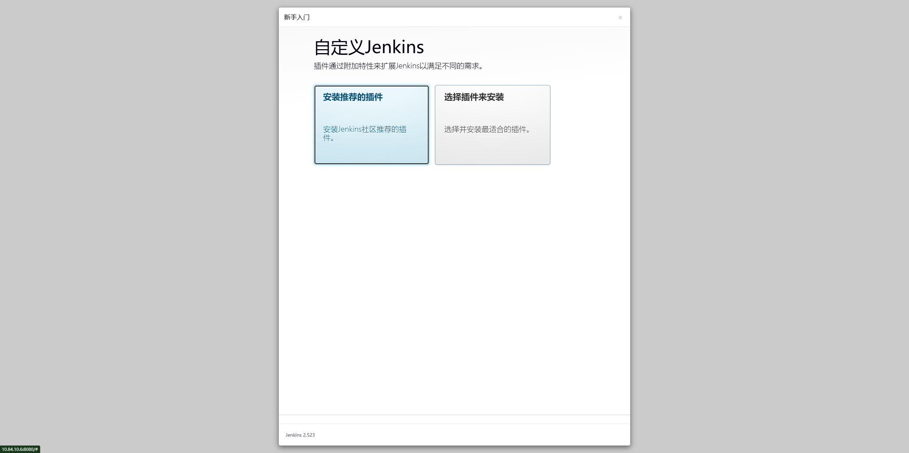

# 食用方法
## 克隆项目
```shell
git clone https://github.com/shacklescn/Work-Notes.git
```
## 进入部署目录
```shell
cd Work-Notes/Jenkins/Deploy
```
## 下载conmpose
```shell
sudo curl -L "https://github.com/docker/compose/releases/download/v2.39.2/docker-compose-linux-x86_64" -o /usr/local/bin/docker-compose && sudo chmod +x /usr/local/bin/docker-compose
```
## 创建Jenkins数据目录并修改目录权限
```shell
mkdir /data/jenkins-data && chown -R 1000:1000 /data/jenkins-data
```
## 启动服务
```shell
docker-compose -p jenkins up -d
```
## 查看登录密码
```shell
root@nightingale:/apps/jenkins# docker-compose logs -f
jenkins  | Running from: /usr/share/jenkins/jenkins.war
jenkins  | webroot: /var/jenkins_home/war
jenkins  | 2025-08-15 01:06:50.117+0000 [id=1]	INFO	winstone.Logger#logInternal: Beginning extraction from war file
jenkins  | 2025-08-15 01:06:50.193+0000 [id=1]	WARNING	o.e.j.ee9.nested.ContextHandler#setContextPath: Empty contextPath
jenkins  | 2025-08-15 01:06:50.246+0000 [id=1]	INFO	org.eclipse.jetty.server.Server#doStart: jetty-12.0.24; built: 2025-08-04T23:40:39.846Z; git: 20bd11c3ce5c2393599bf62873e94a3da7207886; jvm 21.0.8+9-LTS
jenkins  | 2025-08-15 01:06:50.660+0000 [id=1]	INFO	o.e.j.e.w.StandardDescriptorProcessor#visitServlet: NO JSP Support for /, did not find org.eclipse.jetty.ee9.jsp.JettyJspServlet
jenkins  | 2025-08-15 01:06:50.721+0000 [id=1]	INFO	o.e.j.s.DefaultSessionIdManager#doStart: Session workerName=node0
jenkins  | 2025-08-15 01:06:51.087+0000 [id=1]	INFO	hudson.WebAppMain#contextInitialized: Jenkins home directory: /var/jenkins_home found at: EnvVars.masterEnvVars.get("JENKINS_HOME")
jenkins  | 2025-08-15 01:06:51.185+0000 [id=1]	INFO	o.e.j.s.handler.ContextHandler#doStart: Started oeje9n.ContextHandler$CoreContextHandler@42f22995{Jenkins v2.523,/,b=file:///var/jenkins_home/war/,a=AVAILABLE,h=oeje9n.ContextHandler$CoreContextHandler$CoreToNestedHandler@693e4d19{STARTED}}
jenkins  | 2025-08-15 01:06:51.199+0000 [id=1]	INFO	o.e.j.server.AbstractConnector#doStart: Started ServerConnector@5b3f3ba0{HTTP/1.1, (http/1.1)}{0.0.0.0:8080}
jenkins  | 2025-08-15 01:06:51.208+0000 [id=1]	INFO	org.eclipse.jetty.server.Server#doStart: Started oejs.Server@25641d39{STARTING}[12.0.24,sto=0] @1649ms
jenkins  | 2025-08-15 01:06:51.209+0000 [id=81]	INFO	winstone.Logger#logInternal: Winstone Servlet Engine running: controlPort=disabled
jenkins  | 2025-08-15 01:06:51.314+0000 [id=75]	INFO	jenkins.model.Jenkins#<init>: Starting version 2.523
jenkins  | 2025-08-15 01:06:51.384+0000 [id=88]	INFO	jenkins.InitReactorRunner$1#onAttained: Started initialization
jenkins  | 2025-08-15 01:06:51.430+0000 [id=109]	INFO	jenkins.InitReactorRunner$1#onAttained: Listed all plugins
jenkins  | 2025-08-15 01:06:52.312+0000 [id=116]	INFO	jenkins.InitReactorRunner$1#onAttained: Prepared all plugins
jenkins  | 2025-08-15 01:06:52.321+0000 [id=127]	INFO	jenkins.InitReactorRunner$1#onAttained: Started all plugins
jenkins  | 2025-08-15 01:06:52.324+0000 [id=133]	INFO	jenkins.InitReactorRunner$1#onAttained: Augmented all extensions
jenkins  | 2025-08-15 01:06:52.545+0000 [id=154]	INFO	jenkins.InitReactorRunner$1#onAttained: System config loaded
jenkins  | 2025-08-15 01:06:52.547+0000 [id=159]	INFO	jenkins.InitReactorRunner$1#onAttained: System config adapted
jenkins  | 2025-08-15 01:06:52.549+0000 [id=164]	INFO	jenkins.InitReactorRunner$1#onAttained: Loaded all jobs
jenkins  | 2025-08-15 01:06:52.554+0000 [id=171]	INFO	jenkins.InitReactorRunner$1#onAttained: Configuration for all jobs updated
jenkins  | 2025-08-15 01:06:52.615+0000 [id=175]	INFO	jenkins.install.SetupWizard#init: 
jenkins  | 
jenkins  | *************************************************************
jenkins  | *************************************************************
jenkins  | *************************************************************
jenkins  | 
jenkins  | Jenkins initial setup is required. An admin user has been created and a password generated.
jenkins  | Please use the following password to proceed to installation:
jenkins  | 
jenkins  | a0ce5bcdfb9e4865acbb7ea93effbb13     # 第一次安装时初始密码
jenkins  | 
jenkins  | This may also be found at: /var/jenkins_home/secrets/initialAdminPassword
jenkins  | 
jenkins  | *************************************************************
jenkins  | *************************************************************
jenkins  | *************************************************************
```
## 访问Jenkins服务 
浏览器访问 ```http://<Jenkins IP>:8080```
输入 a0ce5bcdfb9e4865acbb7ea93effbb13

选择 ```安装推荐的插件```

## 修改密码
