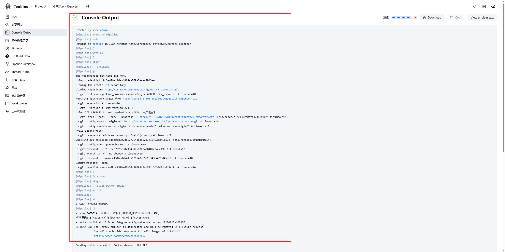
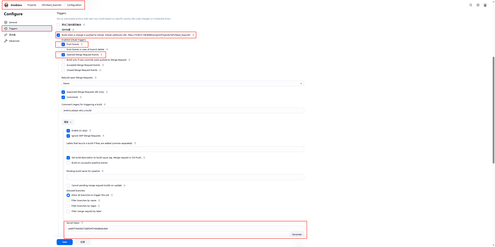

# 前提条件
- 有一个可以正常工作的Jenkins服务并拥有管理员权限
- 有一个可以正常工作的Gitlab服务、服务中有可测试的代码并拥有管理员权限

# gitlab配置
> 注意：本文配置基于gitlab 18.3.0版本进行记录，不同版本UI或有差异
## 设置gitlab为汉化版

## 开启gitlab的出站请求 允许webhooks 对本地网络进行请求

## 创建群组

## 创建项目

## 创建代码仓库并上传代码

> 注意：如果gitlab的端口不是80的，需要将设置的端口加上。

示例：
比如现在在gitlab UI界面中 使用HTTP克隆的链接是下面这样的
```http://10.84.0.106/test/gpustack_exporter.git```

但是gitlab的端口对外暴露的是880，此时应该在IP后面加上880端口 否则会报错
```http://10.84.0.106:880/test/gpustack_exporter.git```

# Jenkins配置
在 Jenkins 中，项目的组织结构通常是层次化的，可以大致表示为：

视图（Views） → 项目文件夹（Folders） → Job（任务）

此处忽略视图，笔记中只记录从 项目文件夹（Folders） → Job（任务）
> 注意：本文配置基于jenkins 2.516.2-lts版本进行记录，不同版本UI或有差异
## 安装Jenkins插件
点击左上角Jenkins → 右上角系统管理 → 插件管理 → Available Plugins → 一个一个搜索（```gitlab、Stage View、Role-based Authorization Strategy、docker pipeline```） → 选择手动安装


## 创建连接代码仓库的凭证
### 1. 点击主页系统管理

### 2. 点击凭证管理

### 3. 添加凭据

### 4. 凭证配置

> harbor的凭证也可以用以上方式来做
## 创建项目目录

登陆界面（首页） → 右上角新建任务 → 输入任务名称 → 点击文件夹 → 点击确定

## 创建流水线job


点击已创建的文件夹 → 点击新建item → 配置下pipeline的作用（比如是哪个项目哪个微服务）→ 流水线配置
```pipeline
pipeline {
    agent any
    
    environment {
        REGISTRY = '10.84.0.106' //harbor的地址
        DOCKER_REPO = 'gpustack/gpustack-exporter' //CI完成后镜像上传到harbor的具体位置
    }
    
    stages {
        stage('Checkout') {
            steps {
                git(
                    url: 'http://10.84.0.106:880/test/gpustack_exporter.git',//gitlab UI界面中 HTTP克隆的链接
                    credentialsId: 'c9b3e679-1f6e-4818-a769-5aaec2bf3aec', //刚才创建的gitlab凭证ID
                    branch: 'main' //克隆的分支 此处以main为例
                )
            }
        }
        
        stage('Build Docker Image') {
            steps {
                script {
                    env.TIMESTAMP = sh(
                        script: 'date +%Y%m%d-%H%M%S', //image 的tag
                        returnStdout: true
                    ).trim()
                    
                    sh """
                        echo '构建镜像: \${REGISTRY}/\${DOCKER_REPO}:\${TIMESTAMP}'
                        docker build -t \${REGISTRY}/\${DOCKER_REPO}:\${TIMESTAMP} .
                    """
                }
            }
        }
        //将CI完成的image 上传至horbor
        stage('Push Image') {
            steps {
                withCredentials([usernamePassword(
                    credentialsId: '72c8121e-367a-412c-b040-0f11c53e070f', //harbor的凭证ID
                    usernameVariable: 'DOCKER_USER', //这里会将harbor的凭证中的用户名传递到DOCKER_USER
                    passwordVariable: 'DOCKER_PASSWORD' //这里会将harbor的凭证中的密码传递到DOCKER_PASSWORD
                )]) {
                    sh """
                        # 登录镜像仓库
                        echo \$DOCKER_PASSWORD | docker login \${REGISTRY} \\
                          -u \$DOCKER_USER --password-stdin
                        
                        # 推送镜像
                        docker push \${REGISTRY}/\${DOCKER_REPO}:\${TIMESTAMP}
                        
                        # 清理本地镜像（可选）
                        # docker rmi \${REGISTRY}/\${DOCKER_REPO}:\${TIMESTAMP} || true
                    """
                }
            }
        }
    }
}
```



# 配置gitlab收到推送代码后自动触发Jenkins进行自动构建
## 配置Jenkins的gitlab插件

> 注意：默认是没有```Build when a change is pushed to GitLab. GitLab webhook```这个选项的，需要安装```gitlab```插件才会有
## 配置gitlab的webhook

> 注意：使用webhook时要开启gitlab的出站请求 允许webhooks 对本地网络进行请求 否则可能会失败
## 验证推送代码时，是否会触发Jenkins自动构建
配置gitlab的webhook阶段完成后会有一个按钮来测试，推送事件，用于测试，可以点击测试下，点击完来到Jenkins这里查看是否在构件中


自动触发构建的任务中会有注释```Started by GitLab push by Administrator```

# Jenkins的RBAC认证
目的是让qwx用户能对ProjectA文件夹以及文件夹下的所有item拥有build和Read权限
## 1. 创建用户
创建一个用户名为```qwx```


## 2. 配置RBAC

### 2.1. 创建全局role

### 2.2. 授权给全局role General 所有资源可读权限

### 2.3. 创建item roles

```ProjectA.*```中的ProjectA是指ProjectA文件夹，```.*```是指ProjectA文件夹下的所有资源都可管理

点击```Add```后role会在item role中创建，可以点击蓝色的```ProjectA.*``` 可查看权限范围
### 2.4. 授权给item role的ProjectA 对个别资源可读可编辑权限

```ProjectA```这个```item roles```对```任务板块```有```build```和```Read```权限并对```view板块```拥有```Read```权限
### 2.5. 创建Assign Roles

第一步将```qwx```用户绑定到拥有全局读权限```General Role```

第二步将给```qwx```用户绑定到```item_role```的```ProjectA```权限
### 2.6. 验证是否生效

重新找个浏览器使用```qwx```账户登录```Jenkins```，发现只能看到(读取)```ProjectA```和```ProjectA```中资源的```build```权限
# JAVA代码pipeline
## JAVA pipeline script
```pipeline
pipeline {
    agent any
    
    environment {
        REGISTRY = '10.84.0.106' //harbor仓库地址
        DOCKER_REPO = 'java_study/java_study' //镜像目录
        JAR_NAME = '/opt/app/demo-service-1.0.0-SNAPSHOT.jar' //dockerfile中的JAR_NAME
    }
    
    stages {
        stage('Checkout') {
            steps {
                git(
                    url: 'http://10.84.0.106:880/test/java_study.git',  //代码仓库
                    credentialsId: 'c9b3e679-1f6e-4818-a769-5aaec2bf3aec',//代码仓库的认证凭证
                    branch: 'main'
                )
            }
        }

        stage('Build Jar (Maven in Docker)') {
            steps {
                script {
                    docker.image('maven:3.3.9-jdk-8').inside("-v $HOME/.m2:/root/.m2") { //mvn 缓存目录，避免重复下载依赖包
                        sh 'mvn -U clean install -DskipTests -s /var/jenkins_home/settings.xml package' //使用mvn编辑java代码  并使用国内的mvn代理源（settings.xml要提前创建并挂载至Jenkins容器中）
                    }
                }
            }
        }

        stage('Archive Jar') {
        steps {
            archiveArtifacts artifacts: 'target/*.jar', fingerprint: true //mvn编译后会把代码放到target/下，jar包的名称在依赖文件pom.xml中定义
            }
        }

        stage('Build Docker Image') {
            steps {
                script {
                    env.TIMESTAMP = sh(
                        script: 'date +%Y%m%d-%H%M%S',//设置容器的tag
                        returnStdout: true
                    ).trim()
                    
                    sh """
                        echo '构建镜像: \${REGISTRY}/\${DOCKER_REPO}:\${TIMESTAMP}'
                        cp src/main/docker/docker-entrypoint.sh docker-entrypoint.sh //此处因为dockerfile的文件中是直接在ADD 的src/main/docker/docker-entrypoint.sh 所以提前将docker-entrypoint.sh脚本copy至根目录
                        docker build \
                            --build-arg JAR_FILE=target/demo-service-1.0.0-SNAPSHOT.jar \ //传递给dockerfile中的JAR_FILE变量 值
                            -f src/main/docker/Dockerfile \
                            -t ${REGISTRY}/${DOCKER_REPO}:${TIMESTAMP} \  
                            .
                    """
                }
            }
        }
        
        stage('Push Image') {
            steps {
                withCredentials([usernamePassword(
                    credentialsId: '72c8121e-367a-412c-b040-0f11c53e070f',//harbor的凭证
                    usernameVariable: 'DOCKER_USER',
                    passwordVariable: 'DOCKER_PASSWORD'
                )]) {
                    sh """
                        # 登录镜像仓库
                        echo \$DOCKER_PASSWORD | docker login \${REGISTRY} \\
                          -u \$DOCKER_USER --password-stdin
                        
                        # 推送镜像
                        docker push \${REGISTRY}/\${DOCKER_REPO}:\${TIMESTAMP}
                        
                        # 清理本地镜像（可选）
                        docker rmi \${REGISTRY}/\${DOCKER_REPO}:\${TIMESTAMP} || true
                    """
                }
            }
        }
    }
}
```