# Higress 是什么?
Higress 官方说明：https://higress.cn/docs/latest/overview/what-is-higress/?spm=36971b57.2ef5001f.0.0.2a932c1flqhpsR

# 部署Higress部署方式
部署方式有四种：
- [使用hgctl 工具](https://higress.cn/docs/latest/ops/hgctl/?spm=36971b57.2ef5001f.0.0.2a932c1flqhpsR)
- [使用 Helm 进行云原生部署](https://higress.cn/docs/latest/ops/deploy-by-helm/?spm=36971b57.2ef5001f.0.0.2a932c1flqhpsR)
- [基于 Docker Compose 进行独立部署](https://higress.cn/docs/latest/ops/deploy-by-docker-compose/?spm=36971b57.2ef5001f.0.0.2a932c1flqhpsR)
- [通过阿里云计算巢快速部署](https://higress.cn/docs/latest/ops/deploy-by-aliyun-computenest/?spm=36971b57.2ef5001f.0.0.2a932c1flqhpsR)

此处使用基于云原生部署的方式来使用Higress
# 部署前提条件
1. 有一个正常使用的标准的K8S集群
2. 有一个可用的LB服务（可选）

# 什么是LB服务？
Kubernetes 并没有为裸金属集群提供网络负载均衡器（即 `LoadBalancer` 类型的 Service）的实现。Kubernetes 所附带的网络负载均衡器实现，实际上只是一些“胶水代码”，用于调用各个 IaaS 平台（如 GCP、AWS、Azure……）的负载均衡服务。如果你没有运行在这些受支持的 IaaS 平台上，那么当你创建 `LoadBalancer` 类型的 Service 时，它将会一直处于 “Pending（等待）” 状态，无法正常工作。

对于裸金属集群的运维人员来说，Kubernetes 只留下了两个相对弱一些的工具来将用户流量引入集群：`NodePort` 和 `externalIPs` 类型的服务。但这两种方式在生产环境中都有显著的缺点，使得裸金属集群在 Kubernetes 生态中成为“二等公民”。
MetalLB和OpenLB 的目标就是为了弥补这一缺陷，提供一个能够与标准网络设备集成的网络负载均衡器实现，使得在裸金属集群中运行的外部服务也能够尽可能地“开箱即用”。
# MetalLB安装前的准备工作
MetalLB 的正常运行需要满足以下条件：

- 一个运行在 Kubernetes 1.13.0 或更高版本的 Kubernetes 集群，且该集群尚未具备网络负载均衡功能。
- 一个能够与 MetalLB 共存的集群网络配置。
- 一些 IPv4 地址，供 MetalLB 分配给外部服务使用。
- 如果使用 BGP 模式，则需要一个或多个支持 BGP 协议 的路由器。
- 如果使用 L2 模式，则必须允许集群节点之间通过 7946 端口（TCP 和 UDP） 进行通信（也可以配置为其他端口），这是 memberlist 所要求的。

MetalLB核心功能的实现依赖于两种机制：

地址分配：基于指定的地址池进行分配；

对外公告：让集群外部的网络了解新分配的IP地址，MetalLB使用ARP、NDP或BGP实现
kube-proxy工作于ipvs模式时，必须要使用严格ARP（StrictARP）模式，因此，若有必要，先运行如下命令，配置kube-proxy。

## 1. 查询kube-proxy是否工作于ipvs模式
```bash
root@minikube:~# kubectl -n kube-system get configmap kube-proxy -o yaml | grep mode
    mode: ipvs
```
## 2. 修改kube-proxy的cm使用ARP（StrictARP）模式，默认为false
```bash
kubectl get configmap kube-proxy -n kube-system -o yaml | \
sed -e "s/strictARP: false/strictARP: true/" | \
kubectl apply -f - -n kube-system
```
## 3. 进入项目目录
```shell
cd Work-Notes/Higress
```

## 4. 安装MetalLB
[通过清单安装](https://metallb.io/installation/#installation-by-manifest)
```bash
kubectl apply -f metallb/metallb-native.yaml
```
## 5. 验证是否安装成功
```bash
root@minikube:~# kubectl get pod -n metallb-system
NAME                          READY   STATUS    RESTARTS   AGE
controller-5f99fd6568-l69gk   1/1     Running   0          27d
speaker-p22q8                 1/1     Running   0          27d
```
## 6. 配置LB地址池和L2模式
```shell
kubectl apply -f metallb/IPAddressPool -f metallb/L2Advertisement.yaml -n metallb-system
```

# 使用 Helm 进行云原生部署Higress并启用AI网关功能
Helm 是一个用于自动化管理和发布 Kubernetes 软件的包管理系统。通过 Helm 可以在您的 Kubernetes 集群上快速部署安装 Higress 网关。

Higress 网关由控制面组件 higress-controller 和数据面组件 higress-gateway 组成。higress-gateway负责承载数据流量，higress-controller 负责管理配置下发。
## 1. 安装higress
```shell
# 只启用AI网关功能
helm install higress -n higress-system higress.io/higress --create-namespace --render-subchart-notes --set global.enableRedis=true

# 启用AI网关功能和内置监控套件
helm install higress -n higress-system higress.io/higress --create-namespace --render-subchart-notes --set global.enableRedis=true --set global.o11y.enabled=true
```
注意：如果k8s集群中已经存在prometheus-operator或kube-prometheus不能启用内置监控套件，他们是互斥的，只能存在其一，不启用内置监控套件时可以对接外部监控可以是prometheus-operator或kube-prometheus
## 2. 常用安装参数
### 🔧 全局参数（Global Parameters）

| 参数名                          | 参数说明                                                                                                                                                                                                                               | 默认值  |
|-------------------------------|----------------------------------------------------------------------------------------------------------------------------------------------------------------------------------------------------------------------------------------|---------|
| `global.local`                | 如果要安装至本地 K8s 集群（如 Kind、Rancher Desktop 等），请设置为 `true`                                                                                                                                                              | `false` |
| `global.ingressClass`         | 用于过滤被 Higress Controller 监听的 Ingress 资源的 IngressClass。<br>特殊取值：<br>1. `"nginx"`：监听 Ingress 为 `nginx` 或为空的资源。<br>2. 空字符串：监听所有 Ingress。                                                              | `higress` |
| `global.watchNamespace`       | 若值不为空，Higress Controller 将只会监听指定命名空间下的资源。<br>适用于多租户隔离场景下限制网关监听范围。                                                                                                                            | `""`    |
| `global.disableAlpnH2`        | 是否在 ALPN 中禁用 HTTP/2 协议                                                                                                                                                                                                         | `false` |
| `global.enableStatus`         | 若为 `true`，Higress Controller 将更新 Ingress 的 `status` 字段。<br>迁移自 Nginx Ingress 时建议设为 `false`。                                                                                                                         | `true`  |
| `global.enableIstioAPI`       | 若为 `true`，Higress Controller 将同时监听 Istio 资源                                                                                                                                                                                  | `false` |
| `global.enableGatewayAPI`     | 若为 `true`，Higress Controller 将同时监听 Gateway API 资源                                                                                                                                                                            | `false` |
| `global.onlyPushRouteCluster` | 若为 `true`，Higress Controller 只推送被路由关联的服务                                                                                                                                                                                 | `true`  |
| `global.o11y.enabled`         | 若为 `true`，将同时安装可观测性套件（Grafana、Prometheus、Loki、PromTail）                                                                                                                                                            | `false` |
| `global.pvc.rwxSupported`     | 标识目标 K8s 集群是否支持 PersistentVolumeClaim 的 ReadWriteMany 操作方式                                                                                                                                                             | `true`  |

### ⚙️ 核心组件参数（Core Component Parameters）

#### `higress-core.gateway`

| 参数名                          | 参数说明                                       | 默认值     |
|-------------------------------|----------------------------------------------|------------|
| `higress-core.gateway.replicas`      | Higress Gateway 的 Pod 数量                  | `2`        |
| `higress-core.gateway.httpPort`      | Higress Gateway 将监听的 HTTP 端口           | `80`       |
| `higress-core.gateway.httpsPort`     | Higress Gateway 将监听的 HTTPS 端口          | `443`      |
| `higress-core.gateway.kind`          | 用于部署 Higress Gateway 的资源类型，可选 `Deployment` 或 `DaemonSet` | `Deployment` |

#### `higress-core.controller`

| 参数名                             | 参数说明                       | 默认值 |
|----------------------------------|------------------------------|--------|
| `higress-core.controller.replicas` | Higress Controller 的 Pod 数量 | `1`  |

[完整版安装参数](https://higress.cn/docs/latest/user/configurations/?spm=36971b57.2ef5001f.0.0.2a932c1flqhpsR)

## 3. 验证是否安装成功
```bash
root@minikube:~# kubectl get pod,svc -n higress-system
NAME                                      READY   STATUS    RESTARTS      AGE
pod/higress-console-75795f445-vn768       1/1     Running   2 (31h ago)   2d10h
pod/higress-controller-5497c65c95-j6784   2/2     Running   4 (31h ago)   2d10h
pod/higress-gateway-6f55cb6d54-jdxvj      1/1     Running   2 (31h ago)   33h
pod/higress-gateway-6f55cb6d54-sj8g2      1/1     Running   2 (31h ago)   33h
pod/redis-stack-server-0                  1/1     Running   2 (31h ago)   2d10h

NAME                         TYPE           CLUSTER-IP      EXTERNAL-IP   PORT(S)                                                             AGE
service/higress-console      ClusterIP      10.233.13.83    <none>        8080/TCP                                                            2d10h
service/higress-controller   ClusterIP      10.233.17.195   <none>        8888/TCP,8889/TCP,15051/TCP,15010/TCP,15012/TCP,443/TCP,15014/TCP   2d10h
higress-gateway              LoadBalancer   10.233.53.184   10.84.3.100   80:31073/TCP,443:30649/TCP                                          2d10h
service/redis-stack-server   ClusterIP      10.233.6.177    <none>        6379/TCP                                                            2d10h
```
# 配置higress-console
## 1. 清除higress默认的ingress规则
```bash
kubectl delete ingress -n higress-system default
```
## 2. 暴露higress-console端口
```bash
kubectl patch svc higress-console -n higress-system -p '{"spec":{"type":"NodePort","ports":[{"port":8080,"targetPort":8080,"nodePort":30928}]}}'
```
## 3. 访问higress-console
higress-console访问地址 : http://10.84.3.100:30928
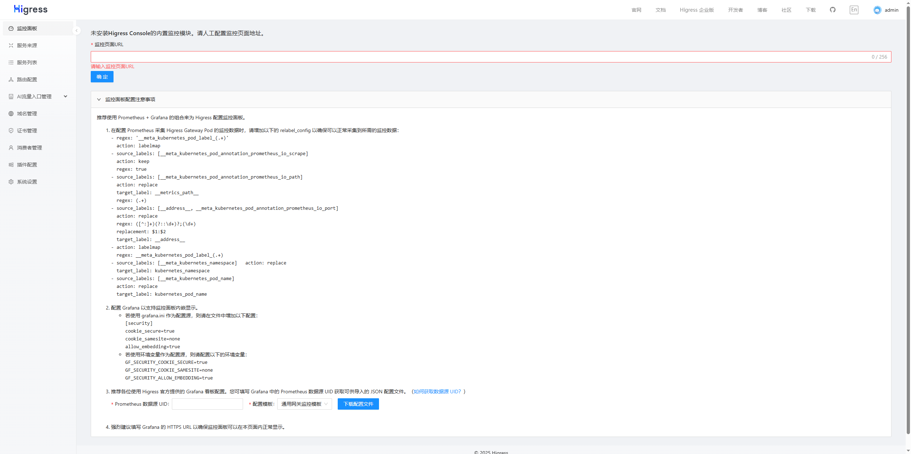

## 4. 对接外部监控
```shell
# 对接prometheus-operator
kubectl apply -f higress-PodMonitor.yaml -n higress-system
```
## 5. 验证是否对接成功
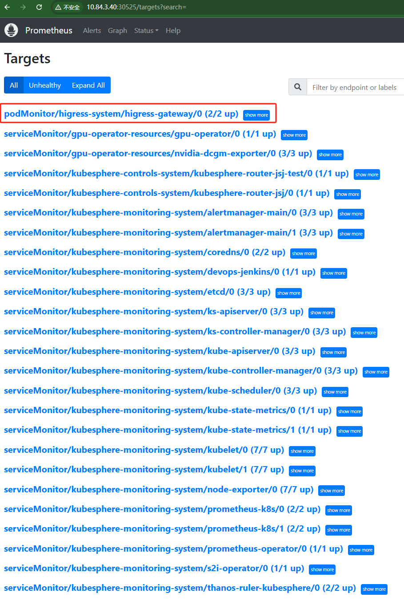
## 6.基于外部监控(Prometheus)实现入口流量观测
导入项目中的Higress-AI-CN.json看板至grafana
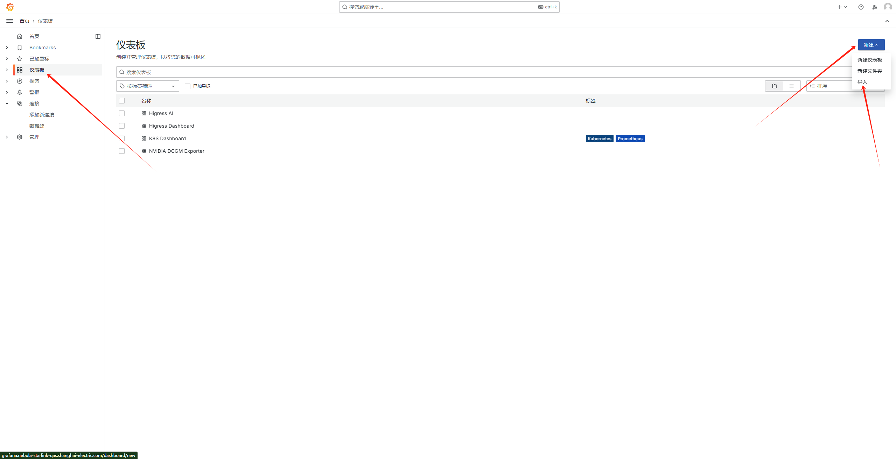
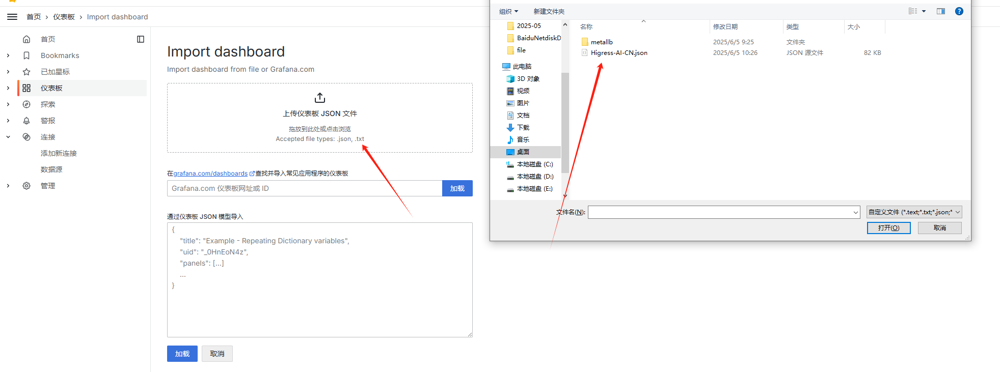
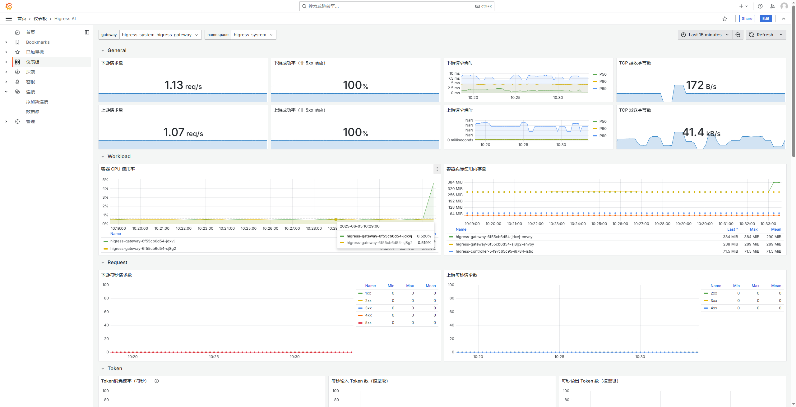
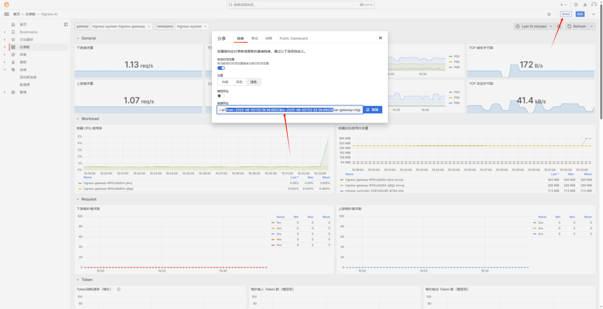
复制地址并将图中选择的时间段参数删除
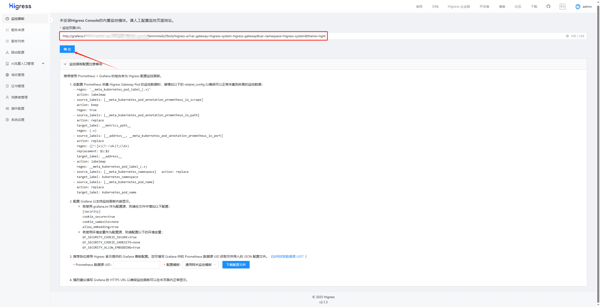
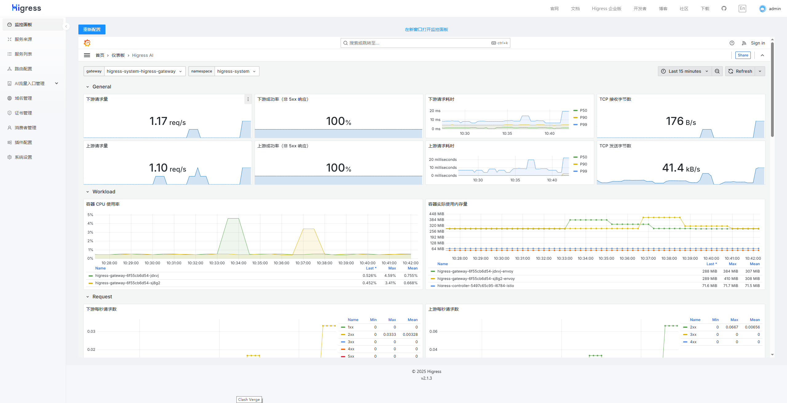
# 配置AI网关
## 1. 创建AI提供者
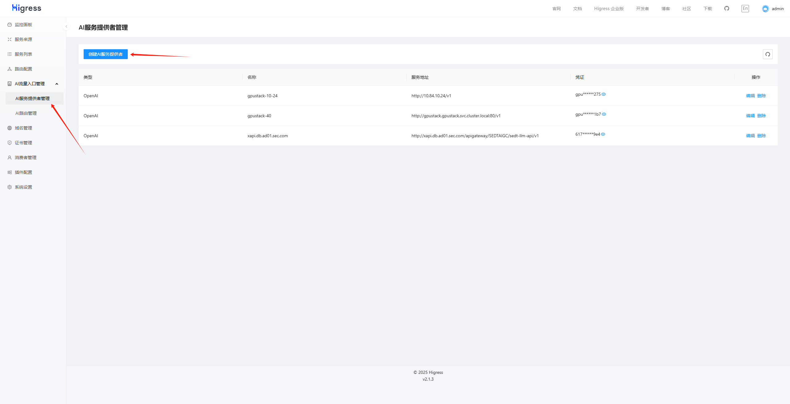
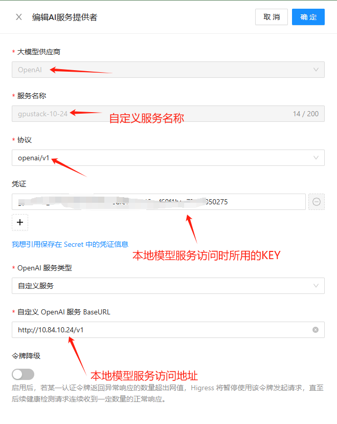
## 2. 创建消费者(访问AI网关所需的认证)
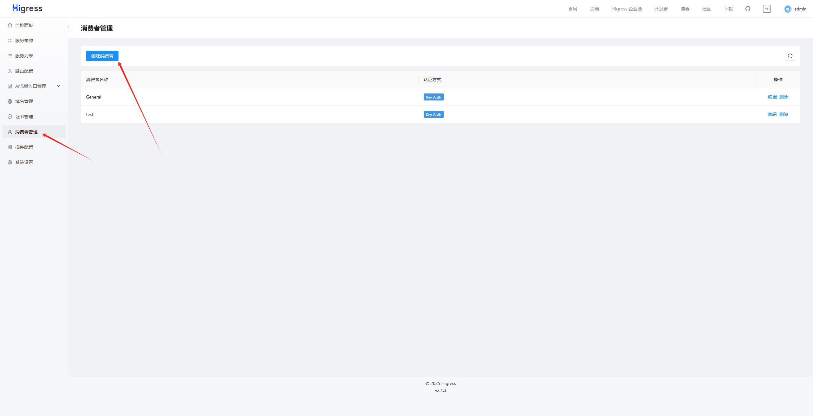
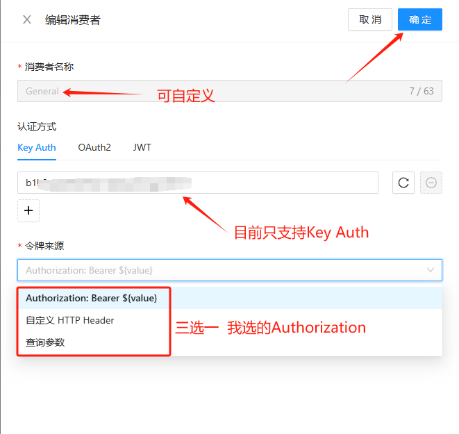
## 3. 创建AI路由
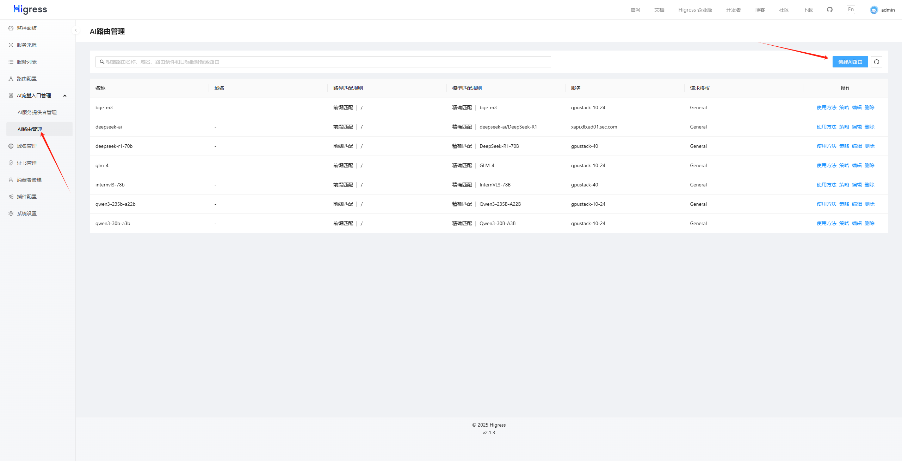
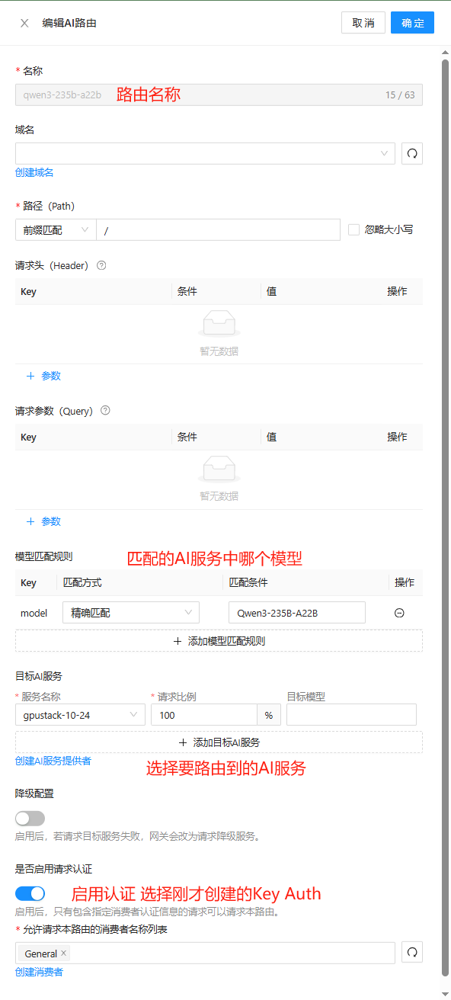
## 4. 测试能否正常访问
```shell
python3 OpenAI-request.py
```

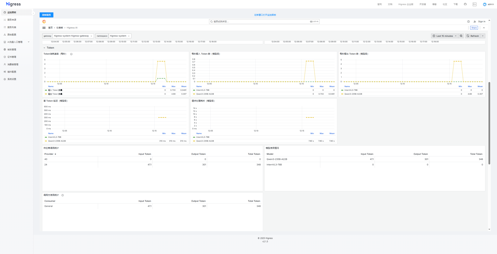