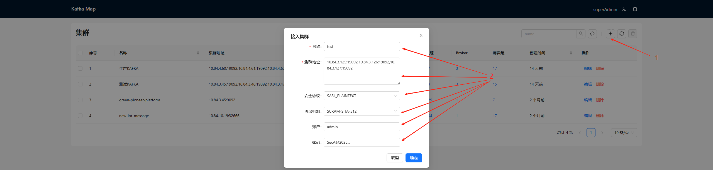

# Kafka 运维手册
| 路径类型                  | 功能描述       |
|-----------------------|------------|
| all-in-one  | 单体的Kafka   |
| Cluster     | 集群运行的kafka |

# 食用方法
## 1、克隆项目
```shell
git clone https://github.com/shacklescn/Work-Notes.git
```
## 2、进入Monitor目录
```shell
cd Work-Notes/Kafka/kafka4
```
## 3、启动Kafka
### 3.1. 单机kafka
```shell
docker-compose -f all-in-one/docker-compose-all-in-one.yaml up -d 
```
### 3.2. 集群kafka
```shell
# 集群节点1
docker-compose -f Cluster/docker-compose-broker1.yaml up -d 

# 集群节点2
docker-compose -f Cluster/docker-compose-broker2.yaml up -d

# 集群节点3
docker-compose -f Cluster/docker-compose-broker3.yaml up -d 
```
## 4. 配置kafka dashborad
访问节点1 8080端口 ```http://<节点1IP>:8080```

