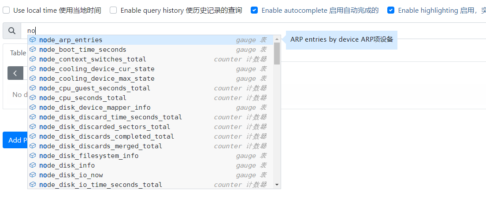

# Node_Exporter 使用手册
## node_exporter 访问认证
### node_exporter启用认证
#### 生成认证密钥
```shell
root@localhost:# htpasswd -nBC 10 "" | tr -d ':\n'; echo
New password:  #输入密钥Seca@2024...
Re-type new password:  #在输入一次密钥Seca@2024...
$2y$10$gBSRwCogOmIjGNa02TW7hu.XcALfWowuA/lMvIDj0GYLGV/udrR5K
```
#### 新增node_exporter认证文件
```shell
cat  > /apps/node_exporter/basic_auth.yaml << 'EOF'
basic_auth_users:
  admin: $2y$10$gBSRwCogOmIjGNa02TW7hu.XcALfWowuA/lMvIDj0GYLGV/udrR5K
EOF
```
#### 创建启停文件
```shell
cat > /etc/systemd/system/node-exporter.service << EOF
[Unit]
Description=Prometheus Node Exporter
After=network.target

[Service]
ExecStart=/apps/node_exporter/node_exporter \
--web.config.file="/apps/node_exporter/basic_auth.yaml"

[Install]
WantedBy=multi-user.target
EOF
```
#### 启动服务
```shell
systemctl daemon-reload && systemctl restart node-exporter && systemctl enable node-exporter
```
##  Promtheus端配置
### 新增job
```shell
  - job_name: 'test'
    basic_auth:
      username:  admin
      password: Seca@2024...
    static_configs:
    - targets: ["10.84.3.124:9100"]
```
### 重新加载配置使job生效
```shell
curl -X POST "http://10.84.3.125:9090/-/reload"
```
### 验证是否生效
