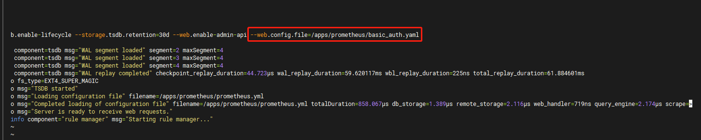
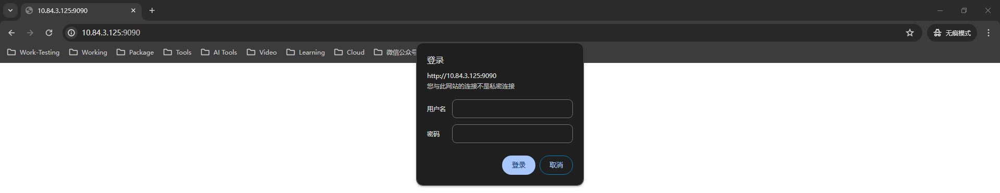

# Prometheus 使用手册
## Prometheus Web UI 身份认证
### 对登录密码进行哈希处理
```shell
root@localhost:# htpasswd -nBC 10 "" | tr -d ':\n'; echo
New password:  #输入要设置的密码
Re-type new password:  #再次输入要设置的密码
$2y$10$4aR1PU21mC.VB7c/HYigNeyVwsG7U1xzgVbvULbqkaE.YsRU8oJpi #对密码哈希过的值
```
### 创建身份认证配置文件
```shell
cat > basic_auth.yaml << 'EOF'
basic_auth_users:
  prometheus: $2y$10$4aR1PU21mC.VB7c/HYigNeyVwsG7U1xzgVbvULbqkaE.YsRU8oJpi
EOF
```
- 用户名：prometheus
- 密码：$2y$10$4aR1PU21mC.VB7c/HYigNeyVwsG7U1xzgVbvULbqkaE.YsRU8oJpi
### 在启动配置中新增密码认证配置信息
```shell
cat > /etc/systemd/system/prometheus.service << EOF
[Unit]
Description=Prometheus Server
Documentation=https://prometheus.io/docs/introduction/overview/
After=network.target

[Service]
Restart=on-failure
WorkingDirectory=/apps/prometheus/
ExecStart=/apps/prometheus/prometheus \
--config.file=/apps/prometheus/prometheus.yml \
--web.enable-lifecycle \
--storage.tsdb.retention=30d \
--web.enable-admin-api \
--web.config.file="/apps/prometheus/basic_auth.yaml"

[Install]
WantedBy=multi-user.target
EOF
```
### 重启服务或者重载服务配置使其生效
#### 1. 重启服务
```shell
systemctl daemon-reload && systemctl restart prometheus
```
#### 2. 重载服务配置
```shell
curl -u prometheus:$2y$10$4aR1PU21mC.VB7c/HYigNeyVwsG7U1xzgVbvULbqkaE.YsRU8oJpi -X POST "http://10.84.3.125:9090/-/reload"
```
### 验证配置是否生效

### 验证Web UI 是否加密
访问Prometheus UI地址  http://10.84.3.125:9090
