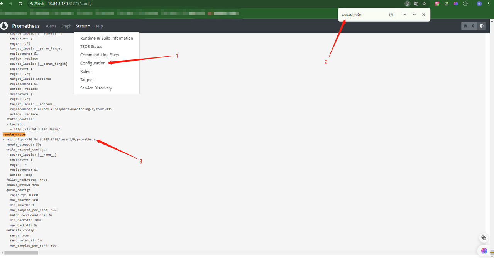

# 基础环境
|   系统版本   |   VictoriaMetrics 版本      |      IP地址    |
| ------------ | --------------------------- | -------------- |
| Ubuntu 20.04 |          v1.101.0           | 10.84.3.123    |
# 官网
https://github.com/VictoriaMetrics/VictoriaMetrics
# 部署
## 1、创建数据目录和日志目录
```shell
mkdir  -p /apps/victoriametrics/{vmstorage-data,logs}
```
## 2、下载二进制软件包并将二进制文件移至工作目录
```shell
wget https://github.com/VictoriaMetrics/VictoriaMetrics/releases/download/v1.101.0/victoria-metrics-linux-amd64-v1.101.0-cluster.tar.gz && tar zxvf victoria-metrics-linux-amd64-v1.101.0-cluster.tar.gz && mv vminsert-prod /usr/local/cluster-victoria-metrics/bin/
```
## 3、创建vm工作目录
```shell
mkdir /usr/local/cluster-victoria-metrics/bin/ -p
```
## 4、部署vmstorage组件
```shell
cat > /etc/systemd/system/vmstorage.service << EOF
[Unit]
Description=Vmstorage Server
After=network.target

[Service]
Restart=on-failure
WorkingDirectory=/usr/local/cluster-victoria-metrics/
ExecStart=/usr/local/cluster-victoria-metrics/bin/vmstorage-prod \
-retentionPeriod 3 \
-storageDataPath /apps/victoriametrics/vmstorage-data \
-memory.allowedBytes 20GB \
-search.maxTagKeys 100000 \
-search.maxTagValues 1000000 \
-search.maxUniqueTimeseries=10000000 \
-loggerTimezone Asia/Shanghai \
-loggerLevel INFO \
-httpListenAddr :8482 \
-vminsertAddr :8400 \
-vmselectAddr :8401
StandardOutput=append:/apps/victoriametrics/logs/output-storage.log
StandardError=append:/apps/victoriametrics/logs/error-storage.log

[Install]
WantedBy=multi-user.target
EOF
```
## 5、启动vmstorage服务
```shell
systemctl daemon-reload && systemctl enable vmstorage.service && systemctl start vmstorage.service && systemctl status vmstorage.service
```
## 6、部署vminsert组件
```shell
cat > /etc/systemd/system/vminsert.service << EOF
[Unit]
Description=Vminsert Server
After=network.target
 
[Service]
Restart=on-failure
WorkingDirectory=/usr/local/cluster-victoria-metrics/
ExecStart=/usr/local/cluster-victoria-metrics/bin/vminsert-prod \
-httpListenAddr :8480 \
-loggerLevel INFO \
-loggerTimezone Asia/Shanghai \
-storageNode=127.0.0.1:8400 \
-maxConcurrentInserts 100 \
-memory.allowedBytes 10GB \
-maxLabelsPerTimeseries 100
StandardOutput=append:/apps/victoriametrics/logs/output-insert.log
StandardError=append:/apps/victoriametrics/logs/error-insert.log 

[Install]
WantedBy=multi-user.target
EOF
```
## 7、启动vminsert服务
```shell
systemctl daemon-reload && systemctl enable vminsert.service && systemctl start vminsert.service && systemctl status vminsert.service
```
## 8、部署vmselect组件
```shell
[Unit]
Description=Vmselect Server
After=network.target
 
[Service]
Restart=on-failure
WorkingDirectory=/usr/local/cluster-victoria-metrics/
ExecStart=/usr/local/cluster-victoria-metrics/bin/vmselect-prod \
-httpListenAddr :8481 \
-loggerLevel INFO \
-loggerTimezone Asia/Shanghai \
-storageNode=127.0.0.1:8401
-memory.allowedBytes 10GB \
-search.maxQueryLen 65535 \
-search.maxSeries 100000 \
-search.maxConcurrentRequests 100000 \
-search.maxSamplesPerQuery 10000000000 \
-search.maxSamplesPerSeries 300000000 \
-search.maxUniqueTimeseries 6000000 \
-search.maxQueryDuration 120s
StandardOutput=append:/apps/victoriametrics/logs/output-select.log
StandardError=append:/apps/victoriametrics/logs/error-select.log 

[Install]
WantedBy=multi-user.target
EOF
```
## 9、启动vmselect服务
```shell
systemctl daemon-reload && systemctl enable vmselect.service && systemctl start vmselect.service && systemctl status vmselect.service
```
## 10、验证
### 查看端口
```shell
root@vm:~# netstat -ntpl | grep vm
tcp        0      0 0.0.0.0:8480            0.0.0.0:*               LISTEN      59145/vminsert-prod 
tcp        0      0 0.0.0.0:8481            0.0.0.0:*               LISTEN      58954/vmselect-prod 
tcp        0      0 0.0.0.0:8482            0.0.0.0:*               LISTEN      55068/vmstorage-pro 
tcp        0      0 0.0.0.0:8400            0.0.0.0:*               LISTEN      55068/vmstorage-pro 
tcp        0      0 0.0.0.0:8401            0.0.0.0:*               LISTEN      55068/vmstorage-pro
```
## vminsert端口
```curl http://127.0.0.1:8480/metrics```
## vmselect端口
```curl http://127.0.0.1:8481/metrics```
## vmstorage端口
```curl http://127.0.0.1:8482/metrics ```
## 11、Prometheus集群写入
### 写入vm时序数据库,
```shell
remote_write:
  - url: http://10.84.3.123:8480/insert/0/prometheus
```
# kube-promtheus接入
## 1、导出Prometheus声明式文件
```shell
kubectl get prometheus k8s -n kubesphere-monitoring-system -o yaml >> prometheus_k8s.yaml
```
## 2、修改Prometheus声明式文件
```shell
spec:
......
  replicas: 1
  remoteWrite:
    - url: "http://10.84.3.123:8480/insert/0/prometheus"
      queueConfig:
        capacity: 10000
        maxShards: 200
        minShards: 1
      writeRelabelConfigs:
        - sourceLabels: [__name__]
          regex: ".*"
          action: keep
  resources:
......
```
## 3、应用修改后的配置
```shell
kubectl apply -f prometheus_k8s.yaml
```
## 4、验证配置是否生效

# 对接Grafane
修改 Grafana 数据源地址为:
```shell
http://10.84.3.123:8481/select/0/prometheus/
```
# 查看VictoriaMetrics图形化界面
访问查询接口select地址
```shell
http://10.84.3.123:8481/select/0/vmui/
```