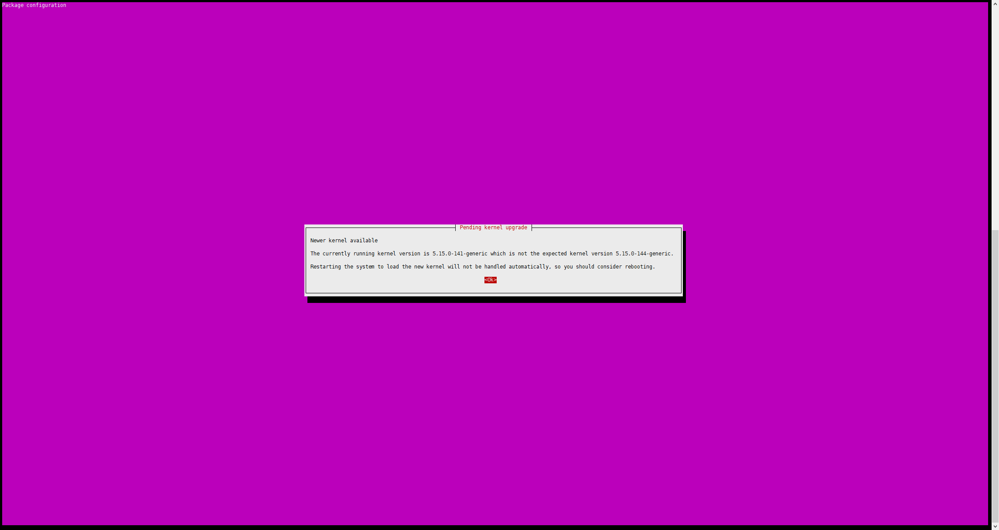

# 运维手册
## Ubuntu 运维手册
### 1 常见问题 FAQ
#### 1.1 apt 安装过程中出现交互提示
> 适用版本：Ubuntu 18.04+（使用 `needrestart` 场景）
##### 现象
1. **内核提示**  
   
   > 检测到新内核，需手动确认是否重启。

2. **服务重启提示**  
   
   > 安装完成后，列出需重启的服务并要求确认。

##### 影响
- 自动化脚本（CI/CD、Ansible、cloud-init）被中断。
- 远程批量部署时无法人工干预。

---

### 2 解决方案

#### 2.1 临时方案（一次性）
在安装命令前添加环境变量，立即生效，无需修改系统配置。

```bash
sudo NEEDRESTART_MODE=l apt install socat conntrack ebtables ipset -y
```
| 变量值 | 含义                        |
| --- | ------------------------- |
| `l` | list only，仅列出需重启项，不提示、不重启 |
#### 2.2 永久方案（推荐）
修改 needrestart 配置文件，彻底关闭交互提示。
```shell
sudo sed -i \
  -e 's/^#\?\$nrconf{kernelhints} = .*/$nrconf{kernelhints} = 0;/' \
  -e 's/^#\?\$nrconf{restart} = .*/$nrconf{restart} = '\''l'\'';/' \
  /etc/needrestart/needrestart.conf
```
| 配置项           | 新值  | 说明            |
| ------------- | --- | ------------- |
| `kernelhints` | `0` | 关闭内核升级提示      |
| `restart`     | `l` | 仅列出服务，不重启、不询问 |

验证修改结果：
```shell
grep -E '^\$nrconf{kernelhints}|^\$nrconf{restart}' /etc/needrestart/needrestart.conf
```
预期输出
```shell
$nrconf{restart} = 'l';
$nrconf{kernelhints} = 0;
```
