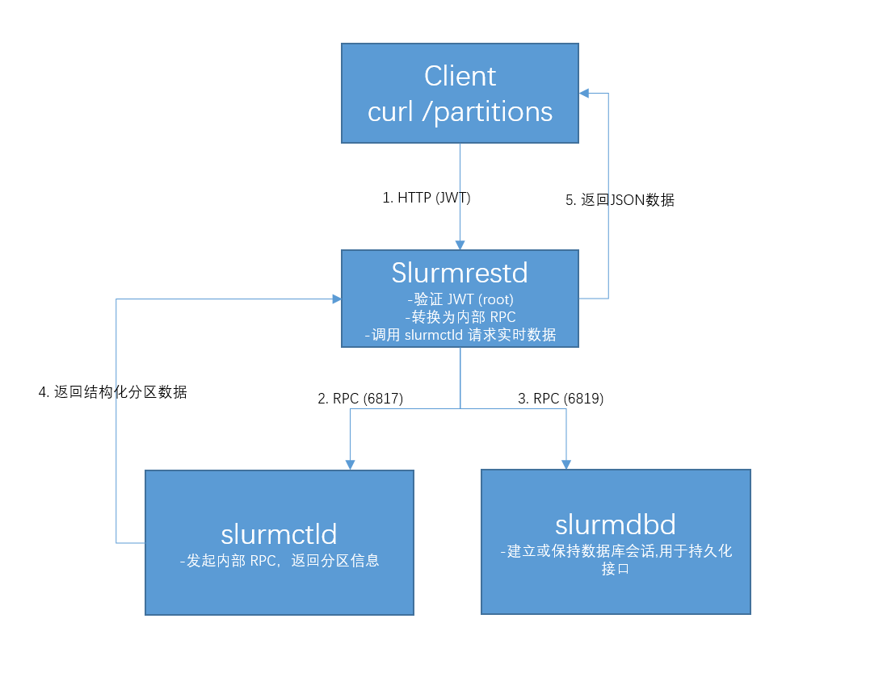

# Slurm使用手册
## 常用指令
```shell
# 重新加载 slurmctld和 slurmd配置文件
sudo scontrol reconfigure

# 节点状态查看
sinfo

# 查看当前用户下运行的作业
squeue

# 查看指定用户下运行的作业
squeue -u <USERNAME>
```
## 节点状态查看
用sinfo可以查看现有的节点、分区、可用状态、作业时间限制、节点数量
```shell
root@server2:~# sinfo
PARTITION AVAIL  TIMELIMIT  NODES  STATE NODELIST
cpu          up   infinite      4   idle server[2-5]
memory       up   infinite      4   idle server[2-5]
gpu*         up   infinite      2   idle server[2-3]
```
**参数解释**

| 关键词        | 含义                                                                      | 
|-------------|-------------------------------------------------------------------------|
| PARTITION| 分区名，大型集群为了方便管理，会将节点划分为不同的分区设置不同权限                                       |
| AVAIL | 可用状态：up 可用；down 不可用                                                     |
| TIMELIMIT | 该分区的作业最大运行时长限制, 30:00 表示30分钟，如果是2-00:00:00表示2天，如果是infinite表示不限时间        | 
| NODES | 节点数量                                                                    | 
| STATE | 状态：drain: 排空状态，表示该类节点不再分配到其他；idle: 空闲状态；alloc: 被分配状态;mix:部分被占用，但是仍有可用资源 | 
| NODELIST | 分区中的节点列表。ceph[01-03] 表示 ceph01, ceph02, ceph03 这三个节点。                       | 

## 查看分区的状态信息
### 1. 查看全部分区状态信息
```shell
root@server2:~# scontrol show partition
PartitionName=cpu
   AllowGroups=ALL AllowAccounts=ALL AllowQos=ALL
   AllocNodes=ALL Default=NO QoS=N/A
   DefaultTime=NONE DisableRootJobs=NO ExclusiveUser=NO ExclusiveTopo=NO GraceTime=0 Hidden=NO
   MaxNodes=UNLIMITED MaxTime=UNLIMITED MinNodes=0 LLN=NO MaxCPUsPerNode=UNLIMITED MaxCPUsPerSocket=UNLIMITED
   Nodes=server[2-5]
   PriorityJobFactor=1 PriorityTier=1 RootOnly=NO ReqResv=NO OverSubscribe=NO
   OverTimeLimit=NONE PreemptMode=OFF
   State=UP TotalCPUs=208 TotalNodes=4 SelectTypeParameters=NONE
   JobDefaults=(null)
   DefMemPerNode=UNLIMITED MaxMemPerNode=UNLIMITED
   TRES=cpu=208,mem=1063398M,node=4,billing=208

PartitionName=memory
   AllowGroups=ALL AllowAccounts=ALL AllowQos=ALL
   AllocNodes=ALL Default=NO QoS=N/A
   DefaultTime=NONE DisableRootJobs=NO ExclusiveUser=NO ExclusiveTopo=NO GraceTime=0 Hidden=NO
   MaxNodes=UNLIMITED MaxTime=UNLIMITED MinNodes=0 LLN=NO MaxCPUsPerNode=UNLIMITED MaxCPUsPerSocket=UNLIMITED
   Nodes=server[2-5]
   PriorityJobFactor=1 PriorityTier=1 RootOnly=NO ReqResv=NO OverSubscribe=NO
   OverTimeLimit=NONE PreemptMode=OFF
   State=UP TotalCPUs=208 TotalNodes=4 SelectTypeParameters=NONE
   JobDefaults=(null)
   DefMemPerNode=UNLIMITED MaxMemPerNode=UNLIMITED
   TRES=cpu=208,mem=1063398M,node=4,billing=208

PartitionName=gpu
   AllowGroups=ALL AllowAccounts=ALL AllowQos=ALL
   AllocNodes=ALL Default=YES QoS=N/A
   DefaultTime=NONE DisableRootJobs=NO ExclusiveUser=NO ExclusiveTopo=NO GraceTime=0 Hidden=NO
   MaxNodes=UNLIMITED MaxTime=UNLIMITED MinNodes=0 LLN=NO MaxCPUsPerNode=UNLIMITED MaxCPUsPerSocket=UNLIMITED
   Nodes=server[2-3]
   PriorityJobFactor=1 PriorityTier=1 RootOnly=NO ReqResv=NO OverSubscribe=NO
   OverTimeLimit=NONE PreemptMode=OFF
   State=UP TotalCPUs=192 TotalNodes=2 SelectTypeParameters=NONE
   JobDefaults=(null)
   DefMemPerNode=UNLIMITED MaxMemPerNode=UNLIMITED
   TRES=cpu=192,mem=1031422M,node=2,billing=192
```
### 2. 查看单个分区的状态信息
```shell
root@server2:~# scontrol show partition gpu
PartitionName=gpu
   AllowGroups=ALL AllowAccounts=ALL AllowQos=ALL
   AllocNodes=ALL Default=YES QoS=N/A
   DefaultTime=NONE DisableRootJobs=NO ExclusiveUser=NO ExclusiveTopo=NO GraceTime=0 Hidden=NO
   MaxNodes=UNLIMITED MaxTime=UNLIMITED MinNodes=0 LLN=NO MaxCPUsPerNode=UNLIMITED MaxCPUsPerSocket=UNLIMITED
   Nodes=server[2-3]
   PriorityJobFactor=1 PriorityTier=1 RootOnly=NO ReqResv=NO OverSubscribe=NO
   OverTimeLimit=NONE PreemptMode=OFF
   State=UP TotalCPUs=192 TotalNodes=2 SelectTypeParameters=NONE
   JobDefaults=(null)
   DefMemPerNode=UNLIMITED MaxMemPerNode=UNLIMITED
   TRES=cpu=192,mem=1031422M,node=2,billing=192
```
## 查看节点的状态信息
### 1.查看全部节点状态信息
```shell
root@server2:~# scontrol show node
NodeName=server2 Arch=x86_64 CoresPerSocket=24 
   CPUAlloc=0 CPUEfctv=96 CPUTot=96 CPULoad=0.01
   AvailableFeatures=(null)
   ActiveFeatures=(null)
   Gres=(null)
   NodeAddr=server2 NodeHostName=server2 Version=25.05.3
   OS=Linux 5.15.0-153-generic #163-Ubuntu SMP Thu Aug 7 16:37:18 UTC 2025 
   RealMemory=515711 AllocMem=0 FreeMem=490720 Sockets=2 Boards=1
   State=IDLE ThreadsPerCore=2 TmpDisk=0 Weight=1 Owner=N/A MCS_label=N/A
   Partitions=cpu,memory,gpu 
   BootTime=2025-09-16T10:50:28 SlurmdStartTime=2025-09-18T10:59:22
   LastBusyTime=2025-09-18T13:46:35 ResumeAfterTime=None
   CfgTRES=cpu=96,mem=515711M,billing=96
   AllocTRES=
   CurrentWatts=0 AveWatts=0

NodeName=server3 Arch=x86_64 CoresPerSocket=24 
   CPUAlloc=0 CPUEfctv=96 CPUTot=96 CPULoad=0.00
   AvailableFeatures=(null)
   ActiveFeatures=(null)
   Gres=(null)
   NodeAddr=server3 NodeHostName=server3 Version=25.05.3
   OS=Linux 5.15.0-151-generic #161-Ubuntu SMP Tue Jul 22 14:25:40 UTC 2025 
   RealMemory=515711 AllocMem=0 FreeMem=508890 Sockets=2 Boards=1
   State=IDLE ThreadsPerCore=2 TmpDisk=0 Weight=1 Owner=N/A MCS_label=N/A
   Partitions=cpu,memory,gpu 
   BootTime=2025-09-08T07:51:39 SlurmdStartTime=2025-09-18T10:56:54
   LastBusyTime=2025-09-18T10:59:30 ResumeAfterTime=None
   CfgTRES=cpu=96,mem=515711M,billing=96
   AllocTRES=
   CurrentWatts=0 AveWatts=0

NodeName=server4 Arch=x86_64 CoresPerSocket=1 
   CPUAlloc=0 CPUEfctv=8 CPUTot=8 CPULoad=0.00
   AvailableFeatures=(null)
   ActiveFeatures=(null)
   Gres=(null)
   NodeAddr=server4 NodeHostName=server4 Version=25.05.3
   OS=Linux 5.15.0-153-generic #163-Ubuntu SMP Thu Aug 7 16:37:18 UTC 2025 
   RealMemory=15988 AllocMem=0 FreeMem=14124 Sockets=8 Boards=1
   State=IDLE ThreadsPerCore=1 TmpDisk=0 Weight=1 Owner=N/A MCS_label=N/A
   Partitions=cpu,memory 
   BootTime=2025-09-17T11:19:05 SlurmdStartTime=2025-09-18T10:56:57
   LastBusyTime=2025-09-18T10:59:30 ResumeAfterTime=None
   CfgTRES=cpu=8,mem=15988M,billing=8
   AllocTRES=
   CurrentWatts=0 AveWatts=0

NodeName=server5 Arch=x86_64 CoresPerSocket=1 
   CPUAlloc=0 CPUEfctv=8 CPUTot=8 CPULoad=0.00
   AvailableFeatures=(null)
   ActiveFeatures=(null)
   Gres=(null)
   NodeAddr=server5 NodeHostName=server5 Version=25.05.3
   OS=Linux 5.15.0-153-generic #163-Ubuntu SMP Thu Aug 7 16:37:18 UTC 2025 
   RealMemory=15988 AllocMem=0 FreeMem=14145 Sockets=8 Boards=1
   State=IDLE ThreadsPerCore=1 TmpDisk=0 Weight=1 Owner=N/A MCS_label=N/A
   Partitions=cpu,memory 
   BootTime=2025-09-17T11:19:09 SlurmdStartTime=2025-09-18T10:57:00
   LastBusyTime=2025-09-18T10:59:30 ResumeAfterTime=None
   CfgTRES=cpu=8,mem=15988M,billing=8
   AllocTRES=
   CurrentWatts=0 AveWatts=0
```
### 2.查看单个节点状态信息
```shell
root@server2:~# scontrol show node server3
NodeName=server3 Arch=x86_64 CoresPerSocket=24 
   CPUAlloc=0 CPUEfctv=96 CPUTot=96 CPULoad=0.00
   AvailableFeatures=(null)
   ActiveFeatures=(null)
   Gres=(null)
   NodeAddr=server3 NodeHostName=server3 Version=25.05.3
   OS=Linux 5.15.0-151-generic #161-Ubuntu SMP Tue Jul 22 14:25:40 UTC 2025 
   RealMemory=515711 AllocMem=0 FreeMem=508890 Sockets=2 Boards=1
   State=IDLE ThreadsPerCore=2 TmpDisk=0 Weight=1 Owner=N/A MCS_label=N/A
   Partitions=cpu,memory,gpu 
   BootTime=2025-09-08T07:51:39 SlurmdStartTime=2025-09-18T10:56:54
   LastBusyTime=2025-09-18T10:59:30 ResumeAfterTime=None
   CfgTRES=cpu=96,mem=515711M,billing=96
   AllocTRES=
   CurrentWatts=0 AveWatts=0
```
## 查看指定显卡的信息
```shell
root@server2:~# srun -p gpu --gres=gpu:nvidia_l40s:2 nvidia-smi
Thu Sep 18 15:46:00 2025       
+-----------------------------------------------------------------------------------------+
| NVIDIA-SMI 570.172.08             Driver Version: 570.172.08     CUDA Version: 12.8     |
|-----------------------------------------+------------------------+----------------------+
| GPU  Name                 Persistence-M | Bus-Id          Disp.A | Volatile Uncorr. ECC |
| Fan  Temp   Perf          Pwr:Usage/Cap |           Memory-Usage | GPU-Util  Compute M. |
|                                         |                        |               MIG M. |
|=========================================+========================+======================|
|   0  NVIDIA L40S                    On  |   00000000:26:00.0 Off |                    0 |
| N/A   37C    P8             35W /  350W |       0MiB /  46068MiB |      0%      Default |
|                                         |                        |                  N/A |
+-----------------------------------------+------------------------+----------------------+
|   1  NVIDIA L40S                    On  |   00000000:8A:00.0 Off |                    0 |
| N/A   35C    P8             33W /  350W |       0MiB /  46068MiB |      0%      Default |
|                                         |                        |                  N/A |
+-----------------------------------------+------------------------+----------------------+
                                                                                         
+-----------------------------------------------------------------------------------------+
| Processes:                                                                              |
|  GPU   GI   CI              PID   Type   Process name                        GPU Memory |
|        ID   ID                                                               Usage      |
|=========================================================================================|
|  No running processes found                                                             |
+-----------------------------------------------------------------------------------------+
```
- ```srun```: Slurm 命令，用于提交和运行作业。
- ```-p gpu```：指定分区为 gpu。意味着作业将被分配到 gpu分区中的节点上运行。
- ```--gres=gpu:nvidia_l40s:2``` ：请求资源，gres代表通用资源（generic resources），```gpu:nvidia_l40s:2``` 具体表示请求两块名为nvidia_l40s的GPU。

以下是 --gres 的细分解释：
- gpu: 资源类型是 GPU。
- nvidia_l40s: GPU 的型号或类型，这里表示 nvidia_l40s 架构的 型号。
- 2: 请求两块 nvidia_l40s GPU。
- nvidia-smi: 要在节点上运行的命令。nvidia-smi 是 NVIDIA 提供的实用工具，用于管理和监控 GPU 状态。
## 追踪任务
### 1. 查看作业列表
squeue来查看当前```<username>```下面所有运行的项目
语法格式：
```shell
squeue -u username
```
示例：
```shell
qwx@server6:/data/jobs/GPU-job$ squeue -u qwx
             JOBID PARTITION     NAME     USER ST       TIME  NODES NODELIST(REASON)
                13       gpu tf_mnist      qwx  R       0:04      1 server2
```
- JOBID: 作业的唯一标识符。每个作业都有一个唯一的 ID。
- PARTITION: 作业提交的分区名称。分区是集群中用于组织资源的逻辑分组。
- NAME: 作业的名称。通常是提交作业时指定的作业名。
- USER: 提交作业的用户名。在这里是 root 用户。
- ST: 作业的状态。可能的状态包括：
- PD (Pending): 作业正在等待资源分配。
- R (Running): 作业正在运行。
- CG (Completing): 作业正在完成。
- CD (Completed): 作业已经完成。
- F (Failed): 作业失败。
- TO (Timeout): 作业超时。
- CA (Canceled): 作业被取消。
- NF (Node Failure): 节点故障。
- PR (Preempted): 作业被抢占。
- TIME: 作业已经运行的时间。格式为 days-hours:minutes:seconds。
- NODES: 作业分配的节点数量。
- NODELIST(REASON): 分配给作业的节点列表，或者如果作业处于待定状态，显示作业等待的原因。


如果作业处于待定状态（PD），NODELIST(REASON) 列会显示等待的原因。常见的原因包括：
- Priority: 优先级较低，等待资源。
- Resources: 等待资源分配。
- Dependency: 依赖其他作业的完成。
- QOSGrpCpuLimit: 超过了分配的 QOS (Quality of Service) CPU 限制。
- JobHeldAdmin: 作业被管理员保持。
- BeginTime：未到用户所指定的任务开始时间。
- Dependency：该作业所依赖的作业尚未完成。
- InvalidAccount：用户的 Slurm 账号无效。
- InvalidQOS：用户指定的 QoS 无效。
- ParitionTimeLimit：用户申请的时间超过该分区时间上限。
- QOSMaxCpuPerUserLimit： 超过当前 QoS 用户最大 CPU 限制。
- QOSMaxGRESPerUser： 超过当前 QoS 用户最大 GRES(GPU) 限制。
- Priority：存在一个或多个更高优先级的任务，该任务需要等待。
- ReqNodeNotAvail: 所申请的部分节点不可用。
- Resources:暂无闲置资源，该任务需等待其他任务完成。
### 2. 查看作业信息
7是执行squeue得到的JOBID
```shell
qwx@server6:/data/jobs/GPU-job$ scontrol show job 13
qwx@server6:~$ scontrol show job 13
JobId=13 JobName=tf_mnist
   UserId=qwx(1001) GroupId=qwx(1001) MCS_label=N/A
   Priority=1 Nice=0 Account=(null) QOS=normal
   JobState=RUNNING Reason=None Dependency=(null)
   Requeue=1 Restarts=0 BatchFlag=1 Reboot=0 ExitCode=0:0
   RunTime=00:01:06 TimeLimit=00:30:00 TimeMin=N/A
   SubmitTime=2025-09-18T16:34:50 EligibleTime=2025-09-18T16:34:50
   AccrueTime=2025-09-18T16:34:50
   StartTime=2025-09-18T16:34:50 EndTime=2025-09-18T17:04:50 Deadline=N/A
   SuspendTime=None SecsPreSuspend=0 LastSchedEval=2025-09-18T16:34:50 Scheduler=Main
   Partition=gpu AllocNode:Sid=10.84.3.165:2067
   ReqNodeList=(null) ExcNodeList=(null)
   NodeList=server2
   BatchHost=server2
   NumNodes=1 NumCPUs=8 NumTasks=1 CPUs/Task=8 ReqB:S:C:T=0:0:*:*
   ReqTRES=cpu=8,mem=10G,node=1,billing=8
   AllocTRES=cpu=8,mem=10G,node=1,billing=8
   Socks/Node=* NtasksPerN:B:S:C=0:0:*:* CoreSpec=*
   MinCPUsNode=8 MinMemoryNode=10G MinTmpDiskNode=0
   Features=(null) DelayBoot=00:00:00
   OverSubscribe=OK Contiguous=0 Licenses=(null) LicensesAlloc=(null) Network=(null)
   Command=/data/jobs/GPU-job/run_my_job.sh
   WorkDir=/data/jobs/GPU-job
   StdErr=/data/jobs/GPU-job/job_output_13.txt
   StdIn=/dev/null
   StdOut=/data/jobs/GPU-job/job_output_13.txt
   TresPerNode=gres/gpu:nvidia_l40s:1
   TresPerTask=cpu=8
```
#### 作业基本信息
```shell
JobId=13 JobName=tf_mnist
   UserId=qwx(1001) GroupId=qwx(1001) MCS_label=N/A
   Priority=1 Nice=0 Account=(null) QOS=normal
```
- JobId=7 → 作业 ID。
- JobName=tf_mnist → 作业名称（你 sbatch 脚本里写的）。
- UserId=qwx(1001) → 提交作业的用户（UID 1001）。
- GroupId=qwx(1001) → 所属用户组。
- Priority=1 → 调度优先级。
- Nice=0 → 类似 Linux 的 nice 值，影响调度优先级。
- QOS=normal → QoS 策略（默认 normal）。
- Account=(null) → 没指定计费账户。
#### 作业状态和运行时间
```shell
   JobState=RUNNING Reason=None Dependency=(null)
   Requeue=1 Restarts=0 BatchFlag=1 Reboot=0 ExitCode=0:0
   RunTime=00:01:06 TimeLimit=00:30:00 TimeMin=N/A
   SubmitTime=2025-09-18T16:34:50 EligibleTime=2025-09-18T16:34:50
   AccrueTime=2025-09-18T16:34:50
   StartTime=2025-09-18T16:34:50 EndTime=2025-09-18T17:04:50 Deadline=N/A
```
- JobState=RUNNING → 当前正在运行。
- Reason=None → 没有等待原因（已经运行）。
- Requeue=1 → 如果失败，允许自动重排队。
- Restarts=0 → 没有重启过。
- ExitCode=0:0 → 退出码（运行中一般是 0:0）。
- RunTime=00:02:58 → 已运行时间。
- TimeLimit=00:30:00 → 最大运行时间（30 分钟）。
- SubmitTime → 提交时间。
- StartTime → 开始运行时间。
- EndTime → 预计结束时间（开始时间 + 限制时间）。
- Deadline=N/A → 没有设置 deadline。
#### 节点与调度信息
```shell
   Partition=gpu AllocNode:Sid=10.84.3.165:2067
   ReqNodeList=(null) ExcNodeList=(null)
   NodeList=server2
   BatchHost=server2
```
- Partition=gpu → 在 gpu 分区运行。
- AllocNode:Sid=10.84.3.165:2067 → 提交作业的客户端节点 (IP:PID)。
- NodeList=server2 → 实际分配到 server2 运行。
- BatchHost=server2 → 批处理脚本运行的宿主节点（也是 server2）。
- ReqNodeList/ExcNodeList → 没有指定必须/排除节点。
#### 资源分配
```shell
   NumNodes=1 NumCPUs=8 NumTasks=1 CPUs/Task=8 ReqB:S:C:T=0:0:*:*
   ReqTRES=cpu=8,mem=10G,node=1,billing=8
   AllocTRES=cpu=8,mem=10G,node=1,billing=8
   Socks/Node=* NtasksPerN:B:S:C=0:0:*:* CoreSpec=*
   MinCPUsNode=8 MinMemoryNode=10G MinTmpDiskNode=0
   Features=(null) DelayBoot=00:00:00
   OverSubscribe=OK Contiguous=0 Licenses=(null) LicensesAlloc=(null) Network=(null)
```
- NumNodes=1 → 要 1 个节点。
- NumCPUs=8 → 总共要 8 个 CPU 核。
- NumTasks=1 → 运行 1 个任务 (MPI rank)。
- CPUs/Task=8 → 每个任务用 8 个 CPU。
- ReqTRES（请求的资源）：CPU=8, 内存=10G, 节点=1。
- AllocTRES（实际分配的资源）：和请求一致。
- MinCPUsNode=8 → 单节点至少 8 核。
- MinMemoryNode=10G → 单节点至少 10G 内存。
- OverSubscribe=OK → 允许 CPU 过度分配（对 CPU 而言，不是 GPU）。
- Licenses=(null) → 没有限制特殊 license。
- 
#### 作业脚本与 IO
```shell
   Command=/data/jobs/GPU-job/run_my_job.sh
   WorkDir=/data/jobs/GPU-job
   StdErr=/data/jobs/GPU-job/job_output_13.txt
   StdIn=/dev/null
   StdOut=/data/jobs/GPU-job/job_output_13.txt
   TresPerNode=gres/gpu:nvidia_l40s:1
   TresPerTask=cpu=8
```
- Command → 运行的脚本。
- WorkDir → 作业运行目录。
- StdOut/StdErr → 标准输出/错误重定向到 job_output_7.txt。
- TresPerNode=gres/gpu:nvidia_l40s:1 → 作业在它被分配到的节点上，可以使用 1 张可用的 GPU。（这里是 1 张 nvidia_l40s）。
- TresPerTask=cpu=8 → 每个任务分配的资源（这里是 CPU=8）。
## 查看历史作业
历史作业可以用sacct来查看，默认情况下，用户仅能查看属于 自己的历史作业。直接使用 sacct 命令会输出从当天 00:00:00 起到当前时间的全部作业。
```shell
qwx@server6:/data/jobs/GPU-job$ sacct
JobID           JobName  Partition    Account  AllocCPUS      State ExitCode 
------------ ---------- ---------- ---------- ---------- ---------- -------- 
2              tf_mnist        gpu                     8     FAILED      1:0 
2.batch           batch                                8     FAILED      1:0 
2.0             python3                                8     FAILED      1:0 
7              tf_mnist        gpu                     8  CANCELLED     0:15 
7.batch           batch                                8  CANCELLED     0:15 
7.0             python3                                8  CANCELLED     0:15
```
> 注意：使用 sacct的前提条件是需要为slurm配置后端数据库，配置完成后才可以正常使用否则会有以下报错 Slurm accounting storage is disabled

查看历史作业时指定打印哪些列的数据
```shell
qwx@server6:/data/jobs/GPU-job$ sacct -X -o JobID,JobName,Partition,State,ExitCode
JobID           JobName  Partition      State ExitCode 
------------ ---------- ---------- ---------- -------- 
2              tf_mnist        gpu     FAILED      1:0 
7              tf_mnist        gpu  CANCELLED     0:15
```
如果用sacct -S MMDD，则会输出从 MM 月 DD 日起的所有历史作业。默认情况会输出作业 ID，作业名，分区，账户，分配的 CPU，任务结束状态，返回码。
### 运行任务
运行任务使用srun命令，其中一些比较有用的参数有：

| 参数      | 含义                 | 
|---------|--------------------|
|-p cpu| 指定分区为CPU分区         |
|--nodes=N| 指定使用的节点数量          |
|--nodelist=comput1| 指定特定节点             |
|--cpus-per-task=4| 指定 CPU 核心数量        |
|--mem-per-cpu=10G| 指定每个CPU核心的内存       |
|--gres=gpu:1| 指定GPU卡数            |
|--ntasks=ntasks| 指定运行的任务个数          |

### 使用示例
#### 准备作业
首先，需要有一个 SLURM 作业脚本。假设我们有一个简单的 Bash 脚本 run_my_job.sh，它在 SLURM 系统中运行一个单进程的 Python 程序：
```shell
cat > run_my_job.sh << EOF
#!/bin/bash
#SBATCH --job-name=tf_mnist
#SBATCH --cpus-per-task=8
#SBATCH --nodes=1
#SBATCH --ntasks=1
#SBATCH --mem=10G
#SBATCH --time=00:30:00
#SBATCH --output=job_output_%j.txt
#SBATCH --partition=gpu
#SBATCH --gres=gpu:nvidia_l40s:1

# ================================
# 设置环境 & 调试信息
# ================================
echo ">>> 作业开始时间: $(date)"
echo ">>> 作业ID: $SLURM_JOB_ID"
echo ">>> 运行节点: $(hostname)"
echo ">>> 当前目录: $(pwd)"

# ================================
# 使用宿主机环境
# ================================
echo ">>> 使用宿主机 Python 环境"
echo ">>> 当前 Python: $(which python3)"
echo ">>> 当前 pip: $(which pip)"

echo ">>> 已安装的包列表:"
pip list

# ================================
# 运行主程序
# ================================
echo ">>> 开始运行 test.py"
srun python3 test.py
EOF
```
这个 SLURM 脚本会提交一个作业，申请 1 个节点、1 个任务，每个任务分配 8 个 CPU 核心、10G 内存 和 1 张 nvidia_l40s GPU。作业运行的输出和错误信息会记录到 job_output_%j.txt 文件中，最终执行的作业名称为 tf_mnist。
```shell
cat > test.py << EOF
import torch
import torch.nn as nn
import torch.optim as optim
from torch.utils.data import DataLoader, Dataset
#from datasets import load_dataset
from datasets import load_dataset, load_from_disk
from transformers import GPT2Tokenizer
import math
from tqdm import tqdm  # 用于显示训练进度条

# ===============================
# MiniGPT 配置类
# ===============================
class Config:
    vocab_size = 50257    # 词汇表大小，与 GPT-2 分词器一致
    n_embd = 256          # 嵌入向量的维度
    n_head = 8            # 多头注意力机制中的注意力头数量
    n_layer = 6           # Transformer 层数
    max_seq_len = 128     # 输入序列的最大长度
    dropout = 0.1         # Dropout 正则化比率，用于防止过拟合


# ===============================
# 多头自注意力机制
# ===============================
class MultiHeadSelfAttention(nn.Module):
    def __init__(self, config):
        super().__init__()
        # 确保嵌入维度能被注意力头数整除
        assert config.n_embd % config.n_head == 0
        self.n_head = config.n_head              # 注意力头数
        self.n_embd = config.n_embd              # 嵌入维度
        self.head_size = config.n_embd // config.n_head  # 每个注意力头的维度

        # 线性变换层，用于生成查询（query）、键（key）和值（value）
        self.query = nn.Linear(config.n_embd, config.n_embd)
        self.key = nn.Linear(config.n_embd, config.n_embd)
        self.value = nn.Linear(config.n_embd, config.n_embd)
        self.dropout = nn.Dropout(config.dropout)  # 注意力权重的 Dropout
        self.out = nn.Linear(config.n_embd, config.n_embd)  # 输出线性层

    def forward(self, x):
        B, T, C = x.size()  # B: 批次大小, T: 序列长度, C: 嵌入维度
        # 计算查询、键、值，并将其重塑为多头格式
        q = self.query(x).reshape(B, T, self.n_head, self.head_size).transpose(1, 2)  # (B, nh, T, hs)
        k = self.key(x).reshape(B, T, self.n_head, self.head_size).transpose(1, 2)    # (B, nh, T, hs)
        v = self.value(x).reshape(B, T, self.n_head, self.head_size).transpose(1, 2)  # (B, nh, T, hs)

        # 计算注意力分数（点积注意力机制）
        scores = torch.matmul(q, k.transpose(-2, -1)) / math.sqrt(self.head_size)  # (B, nh, T, T)

        # 应用因果掩码，确保模型只能看到当前和之前的 token（解码器特性）
        mask = torch.triu(torch.ones(T, T, device=x.device), diagonal=1).bool()
        scores = scores.masked_fill(mask.unsqueeze(0).unsqueeze(0), float('-inf'))

        # 对注意力分数进行 softmax 归一化，得到注意力权重
        attn = torch.softmax(scores, dim=-1)
        attn = self.dropout(attn)  # 应用 Dropout 防止过拟合

        # 使用注意力权重对值（value）进行加权求和
        y = torch.matmul(attn, v)  # (B, nh, T, hs)
        # 将多头结果重塑并拼接为原始维度
        y = y.transpose(1, 2).contiguous().reshape(B, T, C)  # (B, T, C)
        # 最后通过输出线性层
        return self.out(y)


# ===============================
# Transformer 块
# ===============================
class TransformerBlock(nn.Module):
    def __init__(self, config):
        super().__init__()
        self.attn = MultiHeadSelfAttention(config)  # 多头自注意力子层
        self.ln1 = nn.LayerNorm(config.n_embd)     # 第一个层归一化
        # 前馈神经网络（MLP），包括两层线性变换和 GELU 激活函数
        self.mlp = nn.Sequential(
            nn.Linear(config.n_embd, 4 * config.n_embd),  # 扩展维度
            nn.GELU(),                                    # GELU 激活函数
            nn.Linear(4 * config.n_embd, config.n_embd),  # 还原维度
            nn.Dropout(config.dropout)                    # Dropout 正则化
        )
        self.ln2 = nn.LayerNorm(config.n_embd)        # 第二个层归一化

    def forward(self, x):
        # 残差连接 + 层归一化 + 自注意力
        x = x + self.attn(self.ln1(x))
        # 残差连接 + 层归一化 + 前馈网络
        x = x + self.mlp(self.ln2(x))
        return x


# ===============================
# MiniGPT 模型
# ===============================
class MiniGPT(nn.Module):
    def __init__(self, config):
        super().__init__()
        self.config = config
        # 词嵌入层，将 token ID 转换为嵌入向量
        self.token_embedding = nn.Embedding(config.vocab_size, config.n_embd)
        # 位置嵌入层，记录 token 在序列中的位置信息
        self.position_embedding = nn.Embedding(config.max_seq_len, config.n_embd)
        # 堆叠多个 Transformer 块
        self.blocks = nn.ModuleList([TransformerBlock(config) for _ in range(config.n_layer)])
        self.ln_f = nn.LayerNorm(config.n_embd)  # 最后的层归一化
        self.head = nn.Linear(config.n_embd, config.vocab_size, bias=False)  # 输出层，预测词汇表中的 token
        self.dropout = nn.Dropout(config.dropout)  # 输入嵌入的 Dropout

    def forward(self, idx):
        B, T = idx.size()  # B: 批次大小, T: 序列长度
        # 获取 token 嵌入
        tok_emb = self.token_embedding(idx)  # (B, T, C)
        # 获取位置嵌入，生成 0 到 T-1 的位置索引
        pos_emb = self.position_embedding(torch.arange(T, device=idx.device)).unsqueeze(0)  # (1, T, C)
        # 合并 token 嵌入和位置嵌入，并应用 Dropout
        x = self.dropout(tok_emb + pos_emb)
        # 依次通过所有 Transformer 块
        for block in self.blocks:
            x = block(x)
        # 最后的层归一化
        x = self.ln_f(x)
        # 输出预测 logits
        logits = self.head(x)  # (B, T, vocab_size)
        return logits

    @torch.no_grad()
    def generate(self, idx, max_new_tokens):
        # 自回归生成文本
        for _ in range(max_new_tokens):
            # 截取最后 max_seq_len 个 token 以避免超出序列长度限制
            idx_cond = idx[:, -self.config.max_seq_len:]
            # 前向传播获取 logits
            logits = self(idx_cond)
            # 取最后一个时间步的 logits
            logits = logits[:, -1, :]  # (B, vocab_size)
            # 转换为概率分布
            probs = torch.softmax(logits, dim=-1)
            # 从概率分布中采样下一个 token
            idx_next = torch.multinomial(probs, num_samples=1)
            # 将新 token 拼接到序列中
            idx = torch.cat((idx, idx_next), dim=1)
        return idx


# ===============================
# 自定义数据集类（基于 WikiText）
# ===============================
class WikiTextDataset(Dataset):
    def __init__(self, data, tokenizer, max_seq_len):
        self.tokenizer = tokenizer
        self.max_seq_len = max_seq_len
        # 将数据集中的所有文本拼接成一个长字符串
        all_text = " ".join([x["text"] for x in data if x["text"].strip()])
        # 使用分词器将文本编码为 token ID
        tokens = tokenizer.encode(all_text, add_special_tokens=False)
        # 将 token 序列切分为固定长度的片段
        self.examples = []
        for i in range(0, len(tokens) - max_seq_len, max_seq_len):
            chunk = tokens[i:i+max_seq_len]
            self.examples.append(chunk)

    def __len__(self):
        # 返回数据集中的样本数量
        return len(self.examples)

    def __getitem__(self, idx):
        # 返回指定索引的样本，并转换为张量
        return torch.tensor(self.examples[idx], dtype=torch.long)


# ===============================
# 训练函数
# ===============================
def train_model(model, train_loader, optimizer, device, tokenizer, epochs=1):
    model.train()  # 设置模型为训练模式
    # 使用交叉熵损失函数，忽略填充 token 的损失
    criterion = nn.CrossEntropyLoss(ignore_index=tokenizer.pad_token_id)

    for epoch in range(epochs):
        total_loss = 0
        # 使用 tqdm 显示训练进度条
        progress_bar = tqdm(train_loader, desc=f"Epoch {epoch+1}")
        for batch in progress_bar:
            batch = batch.to(device)  # 将批次数据移动到指定设备（CPU/GPU）
            optimizer.zero_grad()     # 清空梯度
            # 输入序列去掉最后一个 token，预测下一个 token
            logits = model(batch[:, :-1])  # (B, T-1, vocab_size)
            # 计算损失，目标是右移一位的序列
            loss = criterion(
                logits.reshape(-1, model.config.vocab_size),
                batch[:, 1:].reshape(-1)
            )
            loss.backward()  # 反向传播
            optimizer.step()  # 更新参数
            total_loss += loss.item()
            # 更新进度条显示当前损失
            progress_bar.set_postfix(loss=loss.item())
        # 打印每个 epoch 的平均损失
        print(f"Epoch {epoch + 1}, Avg Loss: {total_loss / len(train_loader):.4f}")


# ===============================
# 主程序
# ===============================
def main():
    # 加载 WikiText 数据集（训练集）
    #dataset = load_dataset("wikitext", "wikitext-2-raw-v1", split="train")
    dataset = load_dataset(
        "wikitext",
        "wikitext-2-raw-v1",
        split="train",
        cache_dir="datasets"
    )

    if isinstance(dataset, dict) or hasattr(dataset, "keys"):
        dataset = dataset["train"]

    # 加载 GPT-2 分词器
    #tokenizer = GPT2Tokenizer.from_pretrained("gpt2")
    #tokenizer.pad_token = tokenizer.eos_token  # 设置填充 token 为结束 token
    tokenizer = GPT2Tokenizer.from_pretrained("/data/jobs/GPU-job/gpt2-tokenizer")
    tokenizer.pad_token = tokenizer.eos_token

    # 创建自定义数据集和数据加载器
    train_dataset = WikiTextDataset(dataset, tokenizer, Config.max_seq_len)
    train_loader = DataLoader(train_dataset, batch_size=32, shuffle=True)

    # 初始化模型并移动到设备
    device = torch.device("cuda" if torch.cuda.is_available() else "cpu")
    model = MiniGPT(Config()).to(device)
    # 使用 AdamW 优化器，设置学习率和权重衰减
    optimizer = optim.AdamW(model.parameters(), lr=3e-4, weight_decay=0.01)

    # 训练模型
    train_model(model, train_loader, optimizer, device, tokenizer, epochs=3)

    # 使用模型生成文本
    model.eval()  # 设置模型为评估模式
    prompt = "The history of artificial intelligence"  # 提示文本
    # 将提示文本编码为 token ID
    input_ids = torch.tensor([tokenizer.encode(prompt)], dtype=torch.long).to(device)
    # 生成最多 50 个新 token
    generated = model.generate(input_ids, max_new_tokens=50)
    # 解码生成的 token 为文本并打印
    print("\n=== 生成结果 ===")
    print(tokenizer.decode(generated[0], skip_special_tokens=True))


if __name__ == "__main__":
    main()
EOF
```
#### 提交作业
```shell
sbatch -p gpu --mem=10G --cpus-per-task=8 --gres=gpu:nvidia_l40s:1 run_my_job.sh
```
#### 检查作业状态
使用 squeue 命令查看作业状态,默认是显示当前用户所有在队列中的作业的状态。也可以使用```-u```参数指定用户名，找到你刚提交的作业，并记下它的作业 ID
```shell
qwx@server6:/data/jobs/GPU-job$ squeue
             JOBID PARTITION     NAME     USER ST       TIME  NODES NODELIST(REASON)
                14       gpu tf_mnist      qwx  R       0:23      1 server2

qwx@server6:/data/jobs/GPU-job$ squeue -u qwx
             JOBID PARTITION     NAME     USER ST       TIME  NODES NODELIST(REASON)
                14       gpu tf_mnist      qwx  R       0:02      1 server2
```
#### 检验作业进程
```shell
qwx@server6:/data/jobs/GPU-job$ scontrol show job 14
JobId=14 JobName=tf_mnist
   UserId=qwx(1001) GroupId=qwx(1001) MCS_label=N/A
   Priority=1 Nice=0 Account=(null) QOS=normal
   JobState=RUNNING Reason=None Dependency=(null)
   Requeue=1 Restarts=0 BatchFlag=1 Reboot=0 ExitCode=0:0
   RunTime=00:00:06 TimeLimit=00:30:00 TimeMin=N/A
   SubmitTime=2025-09-19T08:47:47 EligibleTime=2025-09-19T08:47:47
   AccrueTime=2025-09-19T08:47:47
   StartTime=2025-09-19T08:47:47 EndTime=2025-09-19T09:17:47 Deadline=N/A
   SuspendTime=None SecsPreSuspend=0 LastSchedEval=2025-09-19T08:47:47 Scheduler=Backfill
   Partition=gpu AllocNode:Sid=10.84.3.165:2067
   ReqNodeList=(null) ExcNodeList=(null)
   NodeList=server2
   BatchHost=server2
   NumNodes=1 NumCPUs=4 NumTasks=1 CPUs/Task=4 ReqB:S:C:T=0:0:*:*
   ReqTRES=cpu=4,mem=10G,node=1,billing=4
   AllocTRES=cpu=4,mem=10G,node=1,billing=4
   Socks/Node=* NtasksPerN:B:S:C=0:0:*:* CoreSpec=*
   MinCPUsNode=4 MinMemoryNode=10G MinTmpDiskNode=0
   Features=(null) DelayBoot=00:00:00
   OverSubscribe=OK Contiguous=0 Licenses=(null) LicensesAlloc=(null) Network=(null)
   Command=/data/jobs/GPU-job/run_my_job.sh
   WorkDir=/data/jobs/GPU-job
   StdErr=/data/jobs/GPU-job/job_output_14.txt
   StdIn=/dev/null
   StdOut=/data/jobs/GPU-job/job_output_14.txt
   TresPerNode=gres/gpu:nvidia_l40s:1
   TresPerTask=cpu=4
```
查找输出中的 Nodes 字段，它会告诉你作业运行在哪个节点上。假设 test.py 正在节点上运行，使用 ps 命令可能会显示如下信息：
```shell
root@server2:~# ps -aux | grep test.p[y]
qwx        59886  0.0  0.0 238636  7732 ?        Sl   08:49   0:00 srun python3 test.py
qwx        59887  0.0  0.0   7140   756 ?        S    08:49   0:00 srun python3 test.py
qwx        60091 80.4  0.2 16985564 1344784 ?    Sl   08:49   0:37 /usr/bin/python3 test.py
```
## slurmrestd、slurmctld和slurmdbd的交互流程
### 1. 用户请求发起
```shell
curl -H "X-SLURM-USER-NAME: root" \
     -H "X-SLURM-USER-TOKEN: eyJh..." \
     http://server7:6820/slurm/v0.0.42/partitions #查询分区信息
```
### 2. slurmrestd 接收到请求
```shell
Oct 10 09:39:08 server7 slurmrestd[64591]: debug:  _on_url: [server7:6820(fd:10)] url scheme:(null) path:/slurm/v0.0.42/partitions query:(null)
Oct 10 09:39:08 server7 slurmrestd[64591]: [2025-10-10T09:39:08.504] operations_router: [server7:6820(fd:10)] GET /slurm/v0.0.42/partitions
Oct 10 09:39:08 server7 slurmrestd[64591]: [2025-10-10T09:39:08.505] rest_auth/jwt: slurm_rest_auth_p_authenticate: [server7:6820(fd:10)] attempting user_name root token authentication pass through
```
- slurmrestd 收到 HTTP GET 请求，目标是 /slurm/v0.0.42/partitions
- REST 层选择对应的处理器 operations_router。
- slurmrestd 从请求头中提取 X-SLURM-USER-NAME 和 X-SLURM-USER-TOKEN。
- 验证 JWT 是否有效（签名、时间、用户一致）。
- 验证通过后，将身份 “root” 传入后续 RPC 请求。
### 3. slurmrestd 调用 slurmctld（主控）
```shell
Oct 10 09:39:08 server2 slurmctld[262298]: [2025-10-10T09:39:08.507] debug3: _on_primary_connection: [server2:6817(fd:3)] PRIMARY: New RPC connection
Oct 10 09:39:08 server2 slurmctld[262298]: [2025-10-10T09:39:08.508] debug2: Processing RPC: REQUEST_PARTITION_INFO from UID=0
```
- slurmrestd 打开了一条新的控制 RPC 连接。
- slurmrestd 内部通过 Slurm RPC socket（默认端口 6817）连接到 slurmctld。
- 它发起 REQUEST_PARTITION_INFO 请求，用于获取分区信息。
- 这一步由 slurmctld 响应当前集群的实时分区数据。
### 4. slurmrestd 同时与 slurmdbd 建立持久连接（会计初始化）
```shell
slurmrestd:
    Oct 10 09:39:08 server7 slurmrestd[64591]: debug:  accounting_storage/slurmdbd: _connect_dbd_conn: Sent PersistInit msg
slurmdbd:
    Oct 10 09:39:08 server2 slurmdbd[262105]: [2025-10-10T09:39:08.512] debug:  REQUEST_PERSIST_INIT: CLUSTER:cool VERSION:11008 UID:0 IP:10.84.3.166 CONN:14
```
- slurmrestd 启动或第一次请求时的行为：建立到 slurmdbd 的“持久会计连接”。
- slurmdbd 日志显示接收到 REQUEST_PERSIST_INIT，记录连接来源 IP、UID、Cluster 名称。
- 若请求的数据类型（如作业、账户）涉及数据库，会进一步访问 MySQL。 
此处请求仅查询分区信息，不依赖数据库内容，所以这次连接仅做初始化握手。
### 5. slurmctld 返回数据 → slurmrestd → HTTP 响应
```shell
Oct 10 09:39:08 server7 slurmrestd[64591]: debug3: _call_handler: [server7:6820(fd:10)] END: calling handler: (0x7FBC7C471AB0) callback_tag 0 for path: /slurm/v0.0.42/partitions rc[0]=No error status[200]=OK
```
- slurmctld 将分区数据结构返回给 slurmrestd。
- slurmrestd 将其序列化为 JSON 并返回 HTTP 200 OK 响应。
此时 curl 会收到 JSON 格式的分区列表（如 debug, main, gpu 等）。


## 用户使用
### 1. 用户账号开通
在控制节点，登录节点和计算节点创建用户并设置登录密码
```shell
useradd -u <UID> -m -d /home/<USERNAME> -s /bin/bash <USERNAME>

passwd <USERNAME>
New password: #输入密码
Retype new password: #在输入一次确认密码

#重载配置文件，刷新配置
sudo scontrol reconfigure
```
### 2. 用户资源配额
#### 2.1. 启用Accounting Enforcement
```shell
# 修改/etc/slurm/slurm.conf
AccountingStorageType=accounting_storage/slurmdbd
AccountingStorageHost=server2
AccountingStorageEnforce=limits,qos
```
#### 2.2. 重载配置
```shell
sudo scontrol reconfigure
```
#### 2.3.用户资源配额配置
```shell
# 创建research账户
sacctmgr -i add account research Description="Research Team"

# 添加qwx用户并关联research账户
sacctmgr -i add user qwx DefaultAccount=research

# 创建 QOS，一次性设置所有限制（包括单作业最大2核、用户总最大2核、最长30天、超限拒绝）
sacctmgr -i add qos limited_resources \
    MaxTRESPerJob=cpu=2 \
    MaxTRESPerUser=cpu=2 \
    MaxWall=30-00:00:00 \
    Flags=DenyOnLimit

# 将limited_resources QOS 分配给用户 qwx
sacctmgr -i modify user qwx set QOS=limited_resources
```
#### 2.4. 验证配置是否生效
```shell
# 验证配置
sacctmgr show user qwx withassoc where account=research
sacctmgr show qos limited_resources format=Name,MaxTRESPerJob,MaxTRESPerUser,MaxWall,Flags

# 验证是否能限制资源
qwx@server6:/data/jobs$ sbatch --cpus-per-task=4 -p cpu -t 10 --wrap="echo hello"
sbatch: error: QOSMaxCpuPerUserLimit
sbatch: error: Batch job submission failed: Job violates accounting/QOS policy (job submit limit, user's size and/or time limits)
```