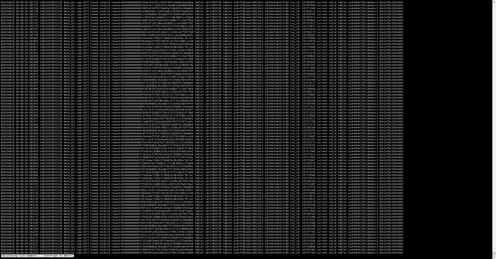

# StarRocks 滚动迁移
## 背景说明
### 现状问题

BE节点 10.84.0.12 磁盘容量告急，需扩展存储路径

节点 10.84.0.18/0.19 因物理限制无法扩容，需下线

10.84.0.12 为 Leader 节点，需保证服务零中断

### 解决方案
采用 滚动迁移（Rolling Migration） 实现：

"新增 BE 节点 → 数据均衡 → 下线旧 BE 节点 → 删除旧 BE"

全程在线操作，客户端无感知的前提需保证每个表的副本不是一个否则这个表在迁移中会无法访问
同时新旧版本需保持一致，**必须一致**否则会报以下元数据不匹配错误



# 旧集群环境
| 节点地址       | 组件  | 角色       |
|--------------|-------|----------|
| 10.84.0.12   | FE&BE | LEADER   |
| 10.84.0.18   | BE    | FOLLOWER |
| 10.84.0.19   | FE&BE | FOLLOWER |

# 新集群环境
| 节点地址        | 组件  | 角色       |
|-------------|-------|----------|
| 10.84.0.12  | FE&BE | LEADER   |
| 10.84.91.16 | FE&BE | FOLLOWER |
| 10.84.91.18 | FE&BE | FOLLOWER |
# 连接LEADER的FE服务
```shell
root@localhost:~# mysql -uroot -h10.84.0.12 -P9030 -p26gaGHTDZUpns7GR
```
# 新增BE和FE节点
```sql
-- 新增FE节点
ALTER SYSTEM ADD FOLLOWER "10.84.91.16:9010", "10.84.91.18:9010";
      
-- 新增BE节点
ALTER SYSTEM ADD BACKEND "10.84.91.16:9050", "10.84.91.18:9050";
```
# 验证 FE和BE 是否加入集群
```sql
-- FE节点
mysql> SHOW FRONTENDS\G;
*************************** 1. row ***************************
             Name: 10.84.0.12_9010_1734934377134
               IP: 10.84.0.12
      EditLogPort: 9010
         HttpPort: 8030
        QueryPort: 9030
          RpcPort: 9020
             Role: LEADER
        ClusterId: 510224456
             Join: true
            Alive: true
ReplayedJournalId: 197425419
    LastHeartbeat: 2025-06-19 12:50:09
         IsHelper: true
           ErrMsg: 
        StartTime: 2025-06-12 14:42:57
          Version: 3.3.3-312ed45
*************************** 2. row ***************************
             Name: 10.84.0.19_9010_1735030041133
               IP: 10.84.0.19
      EditLogPort: 9010
         HttpPort: 8030
        QueryPort: 9030
          RpcPort: 9020
             Role: FOLLOWER
        ClusterId: 510224456
             Join: true
            Alive: true
ReplayedJournalId: 197425393
    LastHeartbeat: 2025-06-19 12:50:09
         IsHelper: true
           ErrMsg: 
        StartTime: 2025-03-08 22:42:24
          Version: 3.3.3-312ed45
*************************** 3. row ***************************
             Name: 10.84.91.16_9010_1750301169517
               IP: 10.84.91.16
      EditLogPort: 9010
         HttpPort: 8030
        QueryPort: 9030
          RpcPort: 9020
             Role: FOLLOWER
        ClusterId: 510224456
             Join: true
            Alive: true
ReplayedJournalId: 197425393
    LastHeartbeat: 2025-06-19 12:50:09
         IsHelper: true
           ErrMsg: 
        StartTime: 2025-06-19 10:48:51
          Version: 3.3.3-312ed45
*************************** 4. row ***************************
             Name: 10.84.91.18_9010_1750300763724
               IP: 10.84.91.18
      EditLogPort: 9010
         HttpPort: 8030
        QueryPort: 9030
          RpcPort: 9020
             Role: FOLLOWER
        ClusterId: 510224456
             Join: true
            Alive: true
ReplayedJournalId: 197425393
    LastHeartbeat: 2025-06-19 12:50:09
         IsHelper: true
           ErrMsg: 
        StartTime: 2025-06-19 10:41:08
          Version: 3.3.3-312ed45
4 rows in set (0.03 sec)


 
 
-- BE节点
mysql> SHOW PROC '/backends'\G
*************************** 1. row ***************************
            BackendId: 17766290
                   IP: 10.84.0.12
        HeartbeatPort: 9050
               BePort: 9060
             HttpPort: 8040
             BrpcPort: 8060
        LastStartTime: 2025-06-17 09:25:12
        LastHeartbeat: 2025-06-19 12:50:29
                Alive: true
 SystemDecommissioned: false
ClusterDecommissioned: false
            TabletNum: 97362
     DataUsedCapacity: 419.858 GB
        AvailCapacity: 38.142 GB
        TotalCapacity: 458 GB
              UsedPct: 91.67 %
       MaxDiskUsedPct: 91.67 %
               ErrMsg: 
              Version: 3.3.3-312ed45
               Status: {"lastSuccessReportTabletsTime":"2025-06-19 12:50:11"}
    DataTotalCapacity: 458 GB
          DataUsedPct: 91.67 %
             CpuCores: 16
    NumRunningQueries: 2
           MemUsedPct: 29.88 %
           CpuUsedPct: 31.2 %
     DataCacheMetrics: Status: Normal, DiskUsage: 0B/980GB, MemUsage: 0B/0B
             Location: 
*************************** 2. row ***************************
            BackendId: 18320972
                   IP: 10.84.0.18
        HeartbeatPort: 9050
               BePort: 9060
             HttpPort: 8040
             BrpcPort: 8060
        LastStartTime: 2025-06-18 09:47:27
        LastHeartbeat: 2025-06-19 12:50:29
                Alive: true
 SystemDecommissioned: false
ClusterDecommissioned: false
            TabletNum: 88969
     DataUsedCapacity: 375.891 GB
        AvailCapacity: 312.079 GB
        TotalCapacity: 783.426 GB
              UsedPct: 60.16 %
       MaxDiskUsedPct: 60.16 %
               ErrMsg: 
              Version: 3.3.3-312ed45
               Status: {"lastSuccessReportTabletsTime":"2025-06-19 12:50:05"}
    DataTotalCapacity: 687.970 GB
          DataUsedPct: 54.64 %
             CpuCores: 16
    NumRunningQueries: 4
           MemUsedPct: 77.38 %
           CpuUsedPct: 32.1 %
     DataCacheMetrics: Status: Normal, DiskUsage: 0B/490GB, MemUsage: 0B/0B
             Location: 
*************************** 3. row ***************************
            BackendId: 10004
                   IP: 10.84.0.19
        HeartbeatPort: 9050
               BePort: 9060
             HttpPort: 8040
             BrpcPort: 8060
        LastStartTime: 2024-12-23 14:26:44
        LastHeartbeat: 2025-06-19 12:50:29
                Alive: true
 SystemDecommissioned: false
ClusterDecommissioned: false
            TabletNum: 96107
     DataUsedCapacity: 406.845 GB
        AvailCapacity: 307.840 GB
        TotalCapacity: 783.426 GB
              UsedPct: 60.71 %
       MaxDiskUsedPct: 60.71 %
               ErrMsg: 
              Version: 3.3.3-312ed45
               Status: {"lastSuccessReportTabletsTime":"2025-06-19 12:49:28"}
    DataTotalCapacity: 714.685 GB
          DataUsedPct: 56.93 %
             CpuCores: 16
    NumRunningQueries: 2
           MemUsedPct: 77.29 %
           CpuUsedPct: 31.1 %
     DataCacheMetrics: Status: Normal, DiskUsage: 0B/500GB, MemUsage: 0B/0B
             Location: 
*************************** 4. row ***************************
            BackendId: 18810542
                   IP: 10.84.91.16
        HeartbeatPort: 9050
               BePort: 9060
             HttpPort: 8040
             BrpcPort: 8060
        LastStartTime: 2025-06-19 11:22:33
        LastHeartbeat: 2025-06-19 12:50:29
                Alive: true
 SystemDecommissioned: false
ClusterDecommissioned: false
            TabletNum: 2761
     DataUsedCapacity: 46.395 GB
        AvailCapacity: 1.354 TB
        TotalCapacity: 1.475 TB
              UsedPct: 8.20 %
       MaxDiskUsedPct: 8.20 %
               ErrMsg: 
              Version: 3.3.3-312ed45
               Status: {"lastSuccessReportTabletsTime":"2025-06-19 12:49:39"}
    DataTotalCapacity: 1.400 TB
          DataUsedPct: 3.24 %
             CpuCores: 32
    NumRunningQueries: 2
           MemUsedPct: 0.68 %
           CpuUsedPct: 3.1 %
     DataCacheMetrics: Status: Normal, DiskUsage: 0B/980GB, MemUsage: 0B/0B
             Location: 
*************************** 5. row ***************************
            BackendId: 18810543
                   IP: 10.84.91.18
        HeartbeatPort: 9050
               BePort: 9060
             HttpPort: 8040
             BrpcPort: 8060
        LastStartTime: 2025-06-19 11:23:08
        LastHeartbeat: 2025-06-19 12:50:29
                Alive: true
 SystemDecommissioned: false
ClusterDecommissioned: false
            TabletNum: 3215
     DataUsedCapacity: 60.314 GB
        AvailCapacity: 1.341 TB
        TotalCapacity: 1.475 TB
              UsedPct: 9.11 %
       MaxDiskUsedPct: 9.11 %
               ErrMsg: 
              Version: 3.3.3-312ed45
               Status: {"lastSuccessReportTabletsTime":"2025-06-19 12:50:18"}
    DataTotalCapacity: 1.400 TB
          DataUsedPct: 4.21 %
             CpuCores: 32
    NumRunningQueries: 0
           MemUsedPct: 0.53 %
           CpuUsedPct: 0.5 %
     DataCacheMetrics: Status: Normal, DiskUsage: 0B/980GB, MemUsage: 0B/0B
             Location: 
5 rows in set (0.01 sec)
```
查看10.84.91.18和10.84.91.16的FE和BE Alive是否为true，如果是true 证明已添加进集群

# 下线LEADER的BE组件
```sql
ALTER SYSTEM DECOMMISSION BACKEND "10.84.0.12:9050";
```
# 验证集群是否收到下线BE信息
```sql
-- BE节点
mysql> SHOW PROC '/backends'\G;
*************************** 1. row ***************************
            BackendId: 10002
                   IP: 10.84.0.12
        HeartbeatPort: 9050
               BePort: 9060
             HttpPort: 8040
             BrpcPort: 8060
        LastStartTime: 2025-06-10 16:31:33
        LastHeartbeat: 2025-06-16 16:44:34
                Alive: true
 SystemDecommissioned: true
ClusterDecommissioned: false
            TabletNum: 23784
     DataUsedCapacity: 129.639 GB
        AvailCapacity: 317.461 GB
        TotalCapacity: 491.082 GB
              UsedPct: 35.35 %
       MaxDiskUsedPct: 35.35 %
               ErrMsg: 
              Version: 3.3.3-312ed45
               Status: {"lastSuccessReportTabletsTime":"2025-06-16 16:43:44"}
    DataTotalCapacity: 447.101 GB
          DataUsedPct: 29.00 %
             CpuCores: 16
    NumRunningQueries: 0
           MemUsedPct: 22.59 %
           CpuUsedPct: 4.8 %
     DataCacheMetrics: Status: Normal, DiskUsage: 0B/110GB, MemUsage: 0B/0B
             Location:
```
BE节点中的SystemDecommissioned参数在执行下线指令后会变成true，默认是false,**下线完成后部分版本可能会自动触发清除该BE,不用执行删除BE指令。如果没有自动清除，就需要手动删除**
# 删除集群中LEADER节点的BE组件（可选）
```sql
ALTER SYSTEM DROP BACKEND "10.84.0.12:9050";
```
# 修改LEADER的BE组件存储位置
```shell
root@ubuntu:~# grep -v "^#\|^$" /starrocks/be/conf/be.conf
sys_log_level = ERROR
be_port = 9060
be_http_port = 8040
heartbeat_service_port = 9050
brpc_port = 8060
starlet_port = 9070
mem_limit=60%
query_cache_size=10G
load_mem_limit = 20G
priority_networks = ${NETWORKS}
storage_root_path = /data2/starrocks/be/ # 修改此路径至新盘

# 重启服务
systemctl restart <BE_SERVICE_name>
```
# 将修复后的BE节点加入集群
```sql
-- 添加BE
ALTER SYSTEM ADD BACKEND "10.84.0.12:9050";
      
-- 验证修改是否生效
mysql> SHOW PROC '/backends'\G
*************************** 1. row ***************************
            BackendId: 17766290
                   IP: 10.84.0.12
        HeartbeatPort: 9050
               BePort: 9060
             HttpPort: 8040
             BrpcPort: 8060
        LastStartTime: 2025-06-17 09:25:12
        LastHeartbeat: 2025-06-19 13:00:39
                Alive: true     -- 状态为true  加入成功
 SystemDecommissioned: false
ClusterDecommissioned: false
            TabletNum: 97518
     DataUsedCapacity: 423.445 GB
        AvailCapacity: 1006.168 GB
        TotalCapacity: 1.475 TB  -- 磁盘扩大  修改生效
              UsedPct: 33.40 %
       MaxDiskUsedPct: 33.40 %
               ErrMsg: 
              Version: 3.3.3-312ed45
               Status: {"lastSuccessReportTabletsTime":"2025-06-19 13:00:18"}
    DataTotalCapacity: 1.396 TB
          DataUsedPct: 29.62 %
             CpuCores: 16
    NumRunningQueries: 0
           MemUsedPct: 26.90 %
           CpuUsedPct: 4.5 %
     DataCacheMetrics: Status: Normal, DiskUsage: 0B/980GB, MemUsage: 0B/0B
             Location: 
*************************** 2. row ***************************
。。。。。。。。。。。。。。。。。。。。。。。。。。。省略。。。。。。。。。。。。。。。。。。。。。。。。。。。。。。。
5 rows in set (0.00 sec)
```

# 下线 10.84.0.18/0.19的FE和BE服务
```sql
-- 下线 0.18 BE服务 建议一个一个下线 
ALTER SYSTEM DECOMMISSION BACKEND "10.84.0.18:9050";
      
-- 下线 0.18 FE服务 建议一个一个下线
ALTER SYSTEM DROP FOLLOWER "10.84.0.18:9010";

-- 下线 0.19 BE服务 建议一个一个下线 
ALTER SYSTEM DECOMMISSION BACKEND "10.84.0.19:9050";
      
-- 下线 0.19 FE服务 建议一个一个下线
ALTER SYSTEM DROP FOLLOWER "10.84.0.19:9010";
```
BE下线完 会自动清除下线的BE,等执行 ```SHOW PROC '/backends'\G;``` 时看不到下线的BE的时候  再下线另外一个