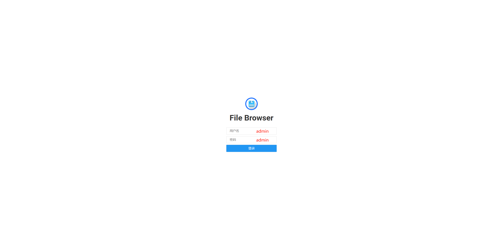

# File Browser是什么？
File Browser是一款自建云软件，可以将其安装在服务器上，指定路径，然后通过美观的网页界面访问文件.
# File Browser能解决什么问题？

如图所示，多个 Pod 使用 PVC 挂载了 CephFS 存储卷。然而，当前访问这些挂载目录的方式较为繁琐，只能通过 kubectl exec 进入 Pod 内部查看和操作数据，极大影响了文件的管理效率。尤其在需要进行文件上传或下载时，操作流程复杂，极大降低了开发和运维的便捷性。

为了解决上述问题，可以使用 File Browser 工具，将多个 PVC 挂载至 File Browser 所在 Pod 的数据目录中，并通过 Service 暴露端口对外访问。这样，用户便可直接通过浏览器实现对文件的可视化管理，包括上传、下载、查看等操作，同时支持用户身份验证和权限控制，显著提升了使用体验和安全性。

# Filebrowser 配置文件解析
```yaml
apiVersion: v1
kind: ConfigMap
metadata:
  name: filebrowser-config
data:
  settings.json: |
    {
      "port": 80,
      "baseURL": "",
      "address": "",
      "log": "stdout",
      "database": "/database/filebrowser.db",
      "root": "/data"
    }
```
| 字段         | 类型     | 含义                                                                    |
| ---------- | ------ | --------------------------------------------------------------------- |
| `port`     | number | Filebrowser 对外提供服务的端口（内部监听）                                           |
| `baseURL`  | string | 如果 Filebrowser 被部署在如 `/filebrowser` 这样的子路径下（比如 nginx 反向代理），就设置它。否则留空。 |
| `address`  | string | 监听的 IP 地址，默认空（表示监听所有地址）。常用 `0.0.0.0`。                                 |
| `log`      | string | 日志输出目标，推荐使用 `"stdout"`，也支持写入文件（不推荐容器中使用）                              |
| `database` | string | SQLite 数据库文件的绝对路径，包含用户信息、配置等。注意路径应指向一个“文件”，不是目录。                      |
| `root`     | string | Filebrowser 根目录，用户访问的默认目录。例如挂载多个 PVC 后，这里可以是 `/data`。                 |

# 部署 Filebrowser
```shell
#进入项目目录
cd Work-Notes/filebrowser

#部署File Browser 
root@minikube:~/Work-Notes/filebrowser# kubecrl apply -f filebrowser-deploy.yaml -n <namespace>
service/filebrowser created
persistentvolumeclaim/filebrowser-db created
deployment.apps/filebrowser created
configmap/filebrowser-config created

#验证是否部署成功
root@minikube:~/Work-Notes/filebrowser# kubectl get -f filebrowser-deploy.yaml -n <namespace>
NAME                  TYPE       CLUSTER-IP     EXTERNAL-IP   PORT(S)        AGE
service/filebrowser   NodePort   10.233.21.65   <none>        80:31921/TCP   57m

NAME                                   STATUS   VOLUME                                     CAPACITY   ACCESS MODES   STORAGECLASS   AGE
persistentvolumeclaim/filebrowser-db   Bound    pvc-e04648ff-ac23-44d3-b56d-074071a5d145   1Gi        RWO            csi-rbd-sc     57m

NAME                          READY   UP-TO-DATE   AVAILABLE   AGE
deployment.apps/filebrowser   1/1     1            1           57m

NAME                           DATA   AGE
configmap/filebrowser-config   1      57m

root@minikube:~/Work-Notes/filebrowser# kubectl logs filebrowser-54b6df644-td9jh -n electrocatalysis
[custom-init] No custom services found, skipping...
[migrations] started
[migrations] no migrations found
───────────────────────────────────────
  _____ __ __ _____ _____ _____ _____ 
 |     |  |  |   __|_   _|     |     |
 |   --|  |  |__   | | | |  |  | | | |
 |_____|_____|_____| |_| |_____|_|_|_|
       _____ __ __ _ __    ____  
      | __  |  |  | |  |  |    \ 
      | __ -|  |  | |  |__|  |  |
      |_____|_____|_|_____|____/ 

  Based on images from linuxserver.io
───────────────────────────────────────

To support LSIO projects visit:
https://www.linuxserver.io/donate/

───────────────────────────────────────
GID/UID
───────────────────────────────────────

User UID:    0
User GID:    0
───────────────────────────────────────
[custom-init] Files found, executing
[custom-init] 20-config: executing...
chown: changing ownership of '/config/settings.json': Read-only file system
[custom-init] 20-config: exited 1
[ls.io-init] done.
2025/06/06 06:26:56 Warning: filebrowser.db can't be found. Initialing in /database/
2025/06/06 06:26:56 Using database: /database/filebrowser.db
2025/06/06 06:26:56 Using config file: /config/settings.json
2025/06/06 06:26:56 Listening on [::]:80
```
注意：在filebrowser root 只能设置为一个路径，不会同时显示多个根目录。

# 访问在Filebrowser
访问：集群节点任意地址:31921

# 汉化Filebrowser

# 管理PVC
